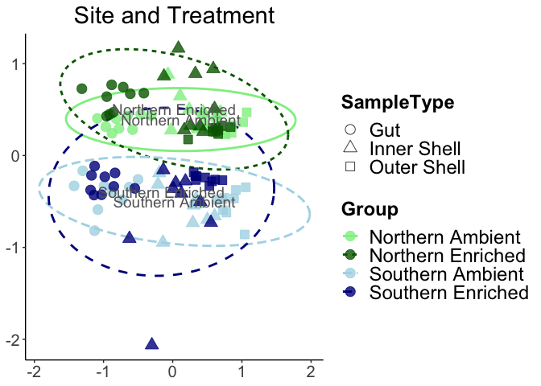

# About the Data

## Conditions

3 oysters per bucket  
3 tissue samples per oyster: gut, inner shell, outer shell  
      = 108 samples total

| Bucket |  Location | Treatment | Station |
|:------:|:---------:|:---------:|:-------:|
|      1 |  Southern |   Control |     BHC |
|      2 |  Southern |   Control |     BHC |
|      3 |  Southern |   Control |     BHC |
|      4 |  Southern |  Enriched |     BHC |
|      5 |  Southern |  Enriched |     BHC |
|      6 |  Southern |  Enriched |     BHC |
|      7 |  Northern |   Control |      BC |
|      8 |  Northern |   Control |      BC |
|      9 |  Northern |   Control |      BC |
|     10 |  Northern |  Enriched |      BC |
|     11 |  Northern |  Enriched |      BC |
|     12 |  Northern |  Enriched |      BC |


## Sequencing

16S V6 region

*Primers*

1064R GTCTCGTGGGCTCGGAGATGTGTATAAGAGACAGCGACRRCCATGCANCACCT\
967F-A TCGTCGGCAGCGTCAGATGTGTATAAGAGACAGCTAACCGANGAACCTYACC\
967F-B TCGTCGGCAGCGTCAGATGTGTATAAGAGACAGCNACGCGAAGAACCTTANC\
967F-C TCGTCGGCAGCGTCAGATGTGTATAAGAGACAGCAACGCGMARAACCTTACC\
967F-D TCGTCGGCAGCGTCAGATGTGTATAAGAGACAGATACGCGARGAACCTTACC

2 x 250 bp paired-end Illumina sequencing

## Analysis

Initially done with QIIME2, dada2 denoising. Eukaryotic reads removed here.

# Setup

## Load libraries and settings


```r
library(tidyverse)
library(scales)
library(ggpubr)
library(qiime2R)
library(vegan)
library(gt)
library(patchwork)
library(UpSetR)
library(gplots)
library(ggh4x)
library(ComplexHeatmap)

# set global theme
theme_set(theme_classic()+
             theme(legend.position ="none",
                   panel.background = element_blank(), plot.background = element_blank(),
                   axis.title = element_text(size=18),
                   legend.title = element_text(size=18, face="bold"),
                   axis.text = element_text(size=15),
                   legend.background = element_blank(),
                   legend.text = element_text(size=18),
                   strip.text = element_text(size=22),
                   plot.title = element_text(hjust=0.5, size=22),
                   strip.background = element_rect(fill="grey80", color="transparent")))

set.seed(567)

# set global options for code output
knitr::opts_chunk$set(echo=TRUE, warning=FALSE,message=FALSE)
```

## Import data


```r
# set file paths for metadata and qiime2 output
metadatafile <- "metadata/PJ_V6Samples_Metadata.txt"
tablefile <- "qiime2output/table.qza"
taxonomyfile <- "qiime2output/taxonomy.qza"
#treefile <- "qiime2output/rooted-tree.qza"

# make ASV table per sample
SVs<-read_qza(tablefile)$data

# make dataframe from metadata
metadata<-read_q2metadata(metadatafile) %>% 
   # clean up sampletype
   mutate(SampleType=factor(SampleType, levels = c("gut","inner swab", "outer swab"),
                            labels = c("Gut", "Inner Shell", "Outer Shell")))


# make dataframe of taxomony per ASV
taxonomy<-read_qza(taxonomyfile)$data %>% parse_taxonomy()
```

## Clean up data


```r
# vector of non-bacterial ASVs
eukASVs <- taxonomy %>% 
   filter(Kingdom=="d__Eukaryota" | Kingdom=="Unassigned" | Phylum=='Cyanobacteria' | Kingdom=='d__Archaea' ) %>%
   rownames_to_column("ASVs")

# clean up ASV data
datafullASVs <- 
   # transpose ASV matrix and make dataframe
   t(SVs) %>% as.data.frame() %>% 
   # set sample names as a column
   rownames_to_column("SampleID") %>% 
   # add in the metadata
   full_join(metadata) %>%
   # make into long form
   pivot_longer("4d42c811fce6eaabd10ae7ce7334bf7f":"1467c8a6122ac19b493fb587db2b32c9") %>% 
   # remove non-bacterial ASVs
   filter(!name %in% eukASVs$ASVs)

# clean up ASV data 
dataASVsClean <- datafullASVs %>% 
   # calculate percent abundance from counts
   group_by(SampleID) %>% mutate(percent=value/sum(value)) %>% 
   # add in all taxonomy data
   left_join(taxonomy %>% rownames_to_column("name")) %>% 
   # remove control data
   filter(SampleType !="water" & SampleType!="control") 

# aggregate data per level
taxasumsclean <- as.data.frame(SVs) %>% 
   # remove controls
   select(-c(RS234_S134, RS235_S140, RS246_S110, RS247_S117)) %>% 
   rownames_to_column("ASV") %>% 
   filter(ASV %in% datafullASVs$name) %>% 
   column_to_rownames(var="ASV") %>% qiime2R::summarize_taxa(taxonomy) 

# clean up ASV matrix table
SVsControls <- as.data.frame(SVs) %>% 
   # remove controls
   select(-c(RS234_S134, RS235_S140, RS246_S110, RS247_S117)) %>% 
   # set ASV names as a column
   rownames_to_column("ASV") %>% 
   filter(ASV %in% datafullASVs$name) %>% 
   # set ASV names as rownames, then transpose
   column_to_rownames(var="ASV") %>% t()

# check that the ASVs in datafullASVscutoff match SVsControls
setdiff(colnames(SVsControls), unique(datafullASVs$name))
```

```
## character(0)
```

```r
# Average per Bucket
SVsControlsAvg <- 
   as.data.frame(SVs) %>% 
   # remove controls
   select(-c(RS234_S134, RS235_S140, RS246_S110, RS247_S117)) %>% 
   # set ASV names as a column
   rownames_to_column("ASV") %>% 
   filter(ASV %in% datafullASVs$name) %>% 
   # convert reads to percent per sample
   mutate(across(where(is.double), ~ .x/sum(.x))) %>% 
   # set ASV names as rownames, then transpose
   column_to_rownames(var="ASV") %>% t() %>% 
   as.data.frame() %>% rownames_to_column("SampleID") %>% left_join(metadata) %>% 
   unite("BucketType", Bucket, SampleType) %>% 
   group_by(BucketType) %>% 
   summarise(across(`4d42c811fce6eaabd10ae7ce7334bf7f`:
                       `1467c8a6122ac19b493fb587db2b32c9`, mean)) %>% 
   column_to_rownames(var="BucketType") 
```

-----

# General QC

## Sequencing controls

*Mock expected*


```r
# expected mock abundances and plot
mockplot <- tibble(SampleName="Expected_Mock",value=0,
   MockTaxa=factor(c("Pseudomonas aeruginosa", "Escherichia coli", 
                     "Salmonella enterica", "Enterococcus faecalis", 
                     "Lactobacillus fermentum","Staphylococcus aureus", 
                     "Listeria monocytogenes", "Bacillus subtilis")),
   percent=c(4.2,10.1,10.4,9.9,18.4,15.5,14.1,17.4)) %>% 
   ggplot(aes(x=SampleName, y=percent, fill=MockTaxa))+
   geom_col(position="fill", alpha=0.8)+
   theme(legend.text = element_text(size=12, colour="gray20", margin = margin(b = 10, unit = "pt")),
         legend.position = "right",legend.direction = "vertical",
         axis.ticks.y = element_line(inherit.blank=FALSE, color="grey30"))+
   scale_fill_manual(values=c("#c5543a","#b8995a","#9cd250","#6eb386",
                              "#8c9fc3","#7e4abb","#c45891","#4b393e"))+
   scale_y_continuous(labels = scales::percent_format(), expand=c(0,0))+
   labs(y="Expected mock species abundance",x=NULL,fill="Mock species", title="Expected mock")
mockplot
```

<!-- -->

*Positive control*


```r
# sequenced blank and mock control plot
seqmockcontrol <- 
   # transpose ASV matrix and make dataframe
   datafullASVs %>% 
   # select only positive control data
   filter(SampleName=="MOCK.CON") %>% 
   filter(value!=0) %>% 
   # add in taxonomy and new column of ASV name
   left_join(read_qza(taxonomyfile)$data, by=c("name"="Feature.ID")) %>% 
   unite("ASVname", c("name", "Taxon"), sep=": \n") %>% 
   # filter just top 20 taxa, group all Others
   mutate(TaxaOther=forcats::fct_lump_n(f=ASVname, w=value, other_level="Others", n=10)) %>% 
   mutate(TaxaOther=reorder(TaxaOther, -value)) %>%
   # calculate percentages per taxa per Sample
   group_by(SampleName) %>% mutate(percent=value/sum(value)) %>% 
   # reorder based on expected mock
   mutate(TaxaOther=factor(TaxaOther,
                           levels=c("281e3624d68f8ff9b997a85e9d5d9f56: \nd__Bacteria; p__Firmicutes; c__Bacilli; o__Bacillales; f__Bacillaceae; g__Bacillus",
                                    "913c2544bf1019abcf31d51cac6e9edb: \nd__Bacteria; p__Proteobacteria; c__Gammaproteobacteria; o__Enterobacterales; f__Enterobacteriaceae",
                                    "f0e13523941c32d798d606bd5df1d43e: \nd__Bacteria; p__Proteobacteria; c__Gammaproteobacteria; o__Enterobacterales; f__Enterobacteriaceae; g__Escherichia-Shigella",
                                    "b8e412fddb124a840dc886233adb7289: \nd__Bacteria; p__Firmicutes; c__Bacilli; o__Lactobacillales; f__Lactobacillaceae; g__Lactobacillus",
                                    "09a0e1e07fd7747e33cdfd76e592f3e6: \nd__Bacteria; p__Firmicutes; c__Bacilli; o__Lactobacillales",
                                    "32ca4fa1d1056e4f185ab0220d55a757: \nd__Bacteria; p__Firmicutes; c__Bacilli; o__Lactobacillales; f__Listeriaceae; g__Listeria",
                                    "144f9431e8a6187a98700a50e2a9af21: \nd__Bacteria; p__Proteobacteria; c__Gammaproteobacteria; o__Pseudomonadales; f__Pseudomonadaceae; g__Pseudomonas",
                                    "446cc81456db29f56e72032cc90e8602: \nd__Bacteria; p__Proteobacteria; c__Gammaproteobacteria; o__Enterobacterales; f__Enterobacteriaceae",
                                    "f9eed79f2bd69b0da2385144b13658a7: \nd__Bacteria; p__Firmicutes; c__Bacilli; o__Staphylococcales; f__Staphylococcaceae",
                                    "5c9b89d5acf8e0020d9de19b53d21663: \nd__Bacteria; p__Firmicutes; c__Bacilli; o__Staphylococcales; f__Staphylococcaceae; g__Staphylococcus",
                                    "Others")))


# make palette based on expected mock
pospalettess2<- seqmockcontrol %>% 
   mutate(colorpal = case_when(grepl("Escherichia",TaxaOther) ~"#9cd250",
                               grepl("446cc8",TaxaOther) ~ "#c45891",
                               grepl("Enterobacteriaceae", TaxaOther) ~ "#b8995a",
                               grepl("Pseudomonas",TaxaOther) ~ "#7e4abb",
                               grepl("Staphylococcaceae",TaxaOther) ~ "#4b393e",
                               grepl("Listeria",TaxaOther) ~"#8c9fc3",
                               grepl("Lactobacillales",TaxaOther) ~ "#6eb386",
                               grepl("Bacillus",TaxaOther) ~ "#c5543a",
                               TaxaOther=="Others" ~ "grey40"))

colors <- distinct(pospalettess2, TaxaOther, colorpal)
pal <- colors$colorpal
names(pal) <- colors$TaxaOther

posconperc <- seqmockcontrol %>% 
   ggplot(aes(x=SampleName, y=percent, fill=TaxaOther))+
   geom_col(position="fill", alpha=0.8, color="white")+
   theme(legend.text = element_text(size=12, colour="gray20", margin = margin(b = 10, unit = "pt")),
         legend.position = "right",legend.direction = "vertical",
         axis.ticks.y = element_line(inherit.blank=FALSE, color="grey30")) +
   scale_fill_manual(values=pal) +
   scale_y_continuous(labels = scales::percent_format(), expand=c(0,0))+
   labs(y="Percent ASV abundance",x=NULL,fill="Positive control ASV", title="Positive")
posconperc
```

<!-- -->


*Negative control*


```r
negconperc <-
   datafullASVs %>% 
   # select only negative control data
   filter(SampleName=="NEG.CON") %>% 
   filter(value!=0) %>% 
   # add in taxonomy and new column of ASV name
   left_join(read_qza(taxonomyfile)$data, by=c("name"="Feature.ID")) %>% 
   unite("ASVname", c("name", "Taxon"), sep=": \n") %>% 
   # filter just top 20 taxa, group all Others
   mutate(TaxaOther=forcats::fct_lump_n(f=ASVname, w=value, other_level="Others", n=12)) %>% 
   mutate(TaxaOther=reorder(TaxaOther, -value)) %>%
   # calculate percentages per taxa per Sample
   group_by(SampleName) %>% mutate(percent=value/sum(value)) %>% 
   ggplot(aes(x=SampleName, y=percent, fill=TaxaOther))+
   geom_col(position="fill", alpha=0.8)+
   theme(legend.text = element_text(size=12, colour="gray20", margin = margin(b = 10, unit = "pt")),
         legend.position = "right",legend.direction = "vertical",
         axis.ticks.y = element_line(inherit.blank=FALSE, color="grey30"))+
   scale_fill_manual(values=c("#A6CEE3", "#1F78B4", "#B2DF8A", "#33A02C", "#FB9A99", "#E31A1C", "#FDBF6F", "#FF7F00",
              "#CAB2D6", "#6A3D9A", "#FFFF99", "#B15928","grey40"))+
   scale_y_continuous(labels = scales::percent_format(), expand=c(0,0))+
   labs(y="Percent ASV abundance",x=NULL, fill="Negative control ASV", title="Negative")
negconperc
```

<!-- -->

*Summary figure*


```r
mockplot+posconperc+negconperc+
   plot_layout(guides="collect") & theme(legend.position = "bottom")
```

<!-- -->


## Reads per sample


```r
reads <- dataASVsClean %>% 
   group_by(SampleID) %>% mutate(sumreads=sum(value)) %>% 
   # simplify data to one value per sample
   distinct(Location, Treatment, SampleType, Group, SampleName, sumreads) %>% 
   # start plotting
   ggplot(aes(x=SampleName, y=sumreads, fill=Group))+
   facet_nested(.~SampleType+Location+Treatment, scales="free",space="free",
                nest_line = element_line(color="white"),
                strip = strip_nested(
                text_x = elem_list_text(face = c("bold","bold","bold",NA,NA,NA,NA,NA,NA,
                                                    NA,NA,NA,NA,NA,NA,NA,NA,NA,NA,NA,NA),
                                        size = c(24,24,24,20,20,20,20,20,20,
                                                    14,14,14,14,14,14,14,14,14,14,14,14))))+
   geom_col(color="white")+
   scale_fill_manual(values=c("lightgreen","darkgreen","lightblue","darkblue"), 
                     labels=c("Northern Ambient", "Northern Enriched", "Southern Ambient", "Southern Enriched"))+
   scale_y_continuous(expand=c(0,0), labels=scales::label_comma())+
   labs(y="Number of sequences",x=NULL,fill=NULL)+
   theme(axis.text.x = element_blank(), strip.text = element_text(size=14))
reads
```

<!-- -->


## Rarefaction curves


```r
# number of ASVs per sample
(S <- specnumber(SVsControls))
```

```
##  RS126_S16  RS127_S28  RS128_S40  RS129_S52  RS130_S64  RS131_S76  RS132_S88 
##        675        553        511        672        268        627        358 
##   RS133_S5  RS134_S17  RS135_S29  RS136_S41  RS137_S53  RS138_S65  RS139_S77 
##        555        588        392        573        725        569        420 
##  RS140_S89   RS141_S6  RS142_S18  RS143_S30  RS144_S42  RS145_S54  RS146_S66 
##        488        648        543        773        760        533        502 
##  RS147_S78  RS148_S90   RS149_S7  RS150_S19  RS151_S31  RS152_S43  RS153_S55 
##        634        517        461        443        653        476        421 
##  RS154_S67  RS155_S79  RS156_S91   RS157_S8  RS158_S20  RS159_S32  RS160_S44 
##        749        534        579        468        482        472        339 
##  RS161_S56  RS162_S68  RS163_S80  RS164_S92   RS165_S9  RS166_S21  RS167_S33 
##        478        715        796        916        611        821        719 
##  RS168_S45  RS169_S57  RS170_S69  RS171_S81  RS172_S93  RS173_S10  RS174_S22 
##        740       1048        770        702        722        861        608 
##  RS175_S34  RS176_S46  RS177_S58  RS178_S70  RS179_S82  RS180_S94  RS181_S11 
##        789        863        867        964        811        796        643 
##  RS182_S23  RS183_S35  RS184_S47  RS185_S59  RS186_S71  RS187_S83  RS188_S95 
##        608        731        785        786        712        503        722 
##  RS189_S12  RS190_S24  RS191_S36  RS192_S48  RS193_S60  RS194_S72  RS195_S84 
##        829        688        704        850        795        640        569 
##  RS196_S96  RS197_S97 RS198_S104 RS199_S111 RS200_S118 RS201_S124 RS202_S130 
##        685        880       1168        999        781        478        798 
## RS203_S136 RS204_S142  RS205_S98 RS206_S105 RS207_S112 RS208_S119 RS209_S125 
##       1465       1083        683        800        834        865        280 
## RS210_S131 RS211_S137 RS212_S143  RS213_S99 RS214_S106 RS215_S113 RS216_S120 
##        763        985        838        558       1054        573        709 
## RS217_S126 RS218_S132 RS219_S138 RS220_S144 RS221_S100 RS222_S107 RS223_S114 
##        784        846        582        904        894        780        757 
## RS224_S121 RS225_S127 RS226_S133 RS227_S139 RS228_S145 RS229_S101 RS230_S108 
##        771        283       1080        954       1045        915        940 
## RS231_S115 RS232_S122 RS233_S128 
##        796        453        795
```

```r
# smallest number of reads in a sample
(raremax <- min(rowSums(SVsControls)))
```

```
## [1] 9490
```

```r
# rarefied number of taxa per sample
Srare <- vegan::rarefy(SVsControls, raremax)
# slope at the end of the rarefacetion curve per sample
Sslope <- vegan::rareslope(SVsControls, raremax)

# plot observed vs rarefied number of ASVs
plot(S, Srare, xlab = "Observed No. of ASVs", ylab = "Rarefied No. of ASVs")
abline(0,1)
```

<!-- -->

```r
# plot slopes
plot(S, Sslope, xlab = "Observed No. of ASVs", ylab = "Slope at rarefied sample size")
```

<!-- -->

```r
# store rarefaction curves data with 100 steps
rarecurve_data <- rarecurve(SVsControls, step = 100, sample = raremax)
```

<!-- -->

```r
# clean plot of rarefaction curves
rareplot<-map_dfr(rarecurve_data, bind_rows) %>% 
   bind_cols(SampleID = rownames(SVsControls),.) %>%
   pivot_longer(-SampleID) %>%
   drop_na() %>%
   mutate(n_seqs = as.numeric(str_replace(name, "N", ""))) %>%
   select(-name) %>%
   left_join(metadata) %>% 
   # edit sampletype labels
   ggplot(aes(x=n_seqs, y=value, group=SampleID, color=Group, lty=SampleType)) +
   geom_line(lwd=0.6) +
   scale_color_manual(values=c("lightgreen","darkgreen","lightblue","darkblue"), 
                     labels=c("Northern Ambient", "Northern Enriched", "Southern Ambient", "Southern Enriched"))+
   scale_x_continuous(labels=label_comma(), expand=c(0,0))+
   scale_y_continuous(expand=c(0,0), limits=c(0,NA))+
   theme(legend.key.width = unit(1.33,"cm"), legend.background = element_blank(),
         legend.position="right", legend.direction = "vertical")+
   labs(x = "Number of sequences", y="Number of ASVs detected", color=NULL, lty=NULL)+
   guides(color=guide_legend(override.aes = list(lwd=4)))
rareplot
```

<!-- -->

### Summary figure


```r
cowplot::plot_grid(reads, rareplot, align="v", axis="l", labels="AUTO", nrow=2)
```

<!-- -->

```r
ggsave("figures/PJamplicons_seqQC.png", bg="transparent", width=11, height=8)
ggsave("figures/PJamplicons_seqQC.pdf", bg="transparent", width=11, height=8)
```

----


# Taxa Barplots

## Phylum level


```r
# set palette
palettephy<-c("#65d6b6","#97007b","#ffbd68","#014aad","#dbacff","#ddc077",
             "#f14690", "#009b75","#7a4600","grey60","grey40")

taxaAvgPhylum <-
   # select aggregated phylum data
   t(taxasumsclean$Phylum) %>% as.data.frame() %>% 
   # put rownames as SampleID
   rownames_to_column("SampleID") %>% 
   # join with the metadata
   left_join(metadata) %>% 
   # convert to long format
   pivot_longer("d__Bacteria; Abditibacteriota":"d__Bacteria; Zixibacteria") %>% 
   # Clean up the phylum names: remove Bacteria; and change NA to Unknown
   mutate(Phylum=str_remove(name, "d__Bacteria; "),
          Phylum=recode(Phylum, "NA"="Unknown")) %>%
   # Make new column PhylumOther where the least abundant phylas are grouped into "Others"
   mutate(PhylumOther=forcats::fct_lump_n(f=Phylum, w=value, other_level="Others", n=10)) %>% 
   # calculate sums per sample per PhylumOther
   group_by(SampleID, PhylumOther) %>% mutate(sumreads=sum(value)) %>% 
   # calculate means per bucket
   group_by(SampleType, Bucket,PhylumOther) %>% mutate(bucketmeanreads=mean(sumreads)) %>% 
   # remove multiple values per bucket per PhylumOther
   distinct(PhylumOther, Location, Treatment, SampleType, Group, Bucket, bucketmeanreads) %>% 
   # sum up total mean reads per phylum so we can order them
   group_by(PhylumOther) %>% mutate(sumphylumOther=sum(bucketmeanreads)) %>% ungroup() %>% 
   # reorder PhylumOther by abundance, then move unknown and other to the end
   mutate(PhylumOther=fct_reorder(PhylumOther, -sumphylumOther),
          PhylumOther=fct_relevel(PhylumOther, "Unknown", after = Inf),
          PhylumOther=fct_relevel(PhylumOther, "Others", after = Inf)) %>% 
   select(-sumphylumOther)
   
   
# start plotting
phylabarplot <- taxaAvgPhylum %>% 
   ggplot(aes(x=Bucket, y=bucketmeanreads, fill=PhylumOther))+
   # panel per sampletype, location, treatment
   facet_nested(.~SampleType+Location+Treatment, scales="free",space="free",
                nest_line = element_line(color="white"),
                strip = strip_nested(
                text_x = elem_list_text(face = c("bold","bold","bold",NA,NA,NA,NA,NA,NA,
                                                    NA,NA,NA,NA,NA,NA,NA,NA,NA,NA,NA,NA),
                                        size = c(24,24,24,20,20,20,20,20,20,
                                                    14,14,14,14,14,14,14,14,14,14,14,14))))+
   # add bars
   geom_col(position="fill", color="white")+
   # edit the theme
   theme(legend.position = "right", 
         legend.background = element_rect(fill=alpha("white", 0.8), color = "transparent"),
         axis.text.x = element_blank(), axis.ticks.x = element_blank(),
         axis.ticks.y = element_line(inherit.blank=FALSE, color="grey30"))+
   # set the colors using our palette
   scale_fill_manual(values=palettephy)+
   # change the y-axis labels to %
   scale_y_continuous(labels = scales::percent_format(), expand=c(0,0))+
   # set the labels
   labs(y="Percent Abundance",x=NULL,fill="Phylum")
phylabarplot
```

<!-- -->


## Order level


```r
# set palette
paletteord <-c("#A6CEE3", "#1F78B4", "#B2DF8A", "#33A02C", "#FB9A99","#E31A1C", "#FDBF6F", "#FF7F00",
             "#CAB2D6", "#6A3D9A", "#FFFF99", "#B15928" ,"grey60","grey40")

# select aggregated order data
t(taxasumsclean$Order) %>% as.data.frame() %>% 
   # put rownames as SampleID
   rownames_to_column("SampleID") %>% 
   # join with the metadata
   left_join(metadata) %>%
   # convert to long format
   pivot_longer("d__Bacteria; Abditibacteriota; Abditibacteria; Abditibacteriales":
                   "d__Bacteria; Zixibacteria; Zixibacteria; Zixibacteria") %>% 
   # Clean up the phylum names: remove Bacteria; and change NA to Unknown
   mutate(Order=str_remove(name, "d__Bacteria; "),
          Order=recode(Order, "NA; NA; NA"="Unknown")) %>%
   # Make new column OrderOther where the least abundant orders are grouped into "Others"
   mutate(OrderOther=forcats::fct_lump_n(f=Order, w=value, other_level="Others", n=13)) %>% 
   # calculate sums per sample per OrderOther
   group_by(SampleID, OrderOther) %>% mutate(sumreads=sum(value)) %>% 
   # calculate means per bucket
   group_by(SampleType, Bucket,OrderOther) %>% mutate(bucketmeanreads=mean(sumreads)) %>% 
   # remove multiple values per bucket per OrderOther
   distinct(OrderOther, Location, Treatment, SampleType, Group, Bucket, bucketmeanreads) %>% 
   # sum up total mean reads per phylum so we can order them
   group_by(OrderOther) %>% mutate(sumOrderOther=sum(bucketmeanreads)) %>% ungroup() %>% 
   # reorder OrderOther by abundance, then move unknown and other to the end
   mutate(OrderOther=fct_reorder(OrderOther, -sumOrderOther),
          OrderOther=fct_relevel(OrderOther, "Unknown", after = Inf),
          OrderOther=fct_relevel(OrderOther, "Others", after = Inf)) %>% 
   # start plotting
   ggplot(aes(x=Bucket, y=bucketmeanreads, fill=OrderOther))+
   # panel per fish type
   facet_nested(.~SampleType+Location+Treatment, scales="free",space="free",
                nest_line = element_line(color="white"),
                strip = strip_nested(
                text_x = elem_list_text(face = c("bold","bold","bold",NA,NA,NA,NA,NA,NA,
                                                    NA,NA,NA,NA,NA,NA,NA,NA,NA,NA,NA,NA),
                                        size = c(24,24,24,20,20,20,20,20,20,
                                                    14,14,14,14,14,14,14,14,14,14,14,14))))+
   # add bars
   geom_col(position="fill", color="white")+
   # edit the theme
   theme(legend.position = "bottom", 
         legend.background = element_rect(fill=alpha("white", 0.8), color = "transparent"),
         axis.text.x = element_blank(), axis.ticks.x = element_blank(),
         axis.ticks.y = element_line(inherit.blank=FALSE, color="grey30"))+
   # set the colors using our palette
   scale_fill_manual(values=paletteord)+
   # change the y-axis labels to %
   scale_y_continuous(labels = scales::percent_format(), expand=c(0,0))+
   # set the labels
   labs(y="Percent Abundance per Order",x=NULL,fill="Order")
```

<!-- -->


```r
# select aggregated order data
t(taxasumsclean$Order) %>% as.data.frame() %>% 
   # put rownames as SampleID
   rownames_to_column("SampleID") %>% 
   # join with the metadata
   left_join(metadata) %>% 
   # convert to long format
   pivot_longer("d__Bacteria; Abditibacteriota; Abditibacteria; Abditibacteriales":
                   "d__Bacteria; Zixibacteria; Zixibacteria; Zixibacteria") %>% 
   # Clean up the phylum names: remove Bacteria; and change NA to Unknown
   mutate(Order=str_remove(name, "d__Bacteria; "),
          Order=recode(Order, "NA; NA; NA"="Unknown")) %>%
   # Make new column OrderOther where the least abundant orders are grouped into "Others"
   mutate(OrderOther=forcats::fct_lump_n(f=Order, w=value, other_level="Others", n=25)) %>% 
   # calculate sums per sample per OrderOther
   group_by(SampleID, OrderOther) %>% mutate(sumreads=sum(value)) %>% 
   # calculate means per bucket
   group_by(SampleType, Bucket, OrderOther) %>% mutate(bucketmeanreads=mean(sumreads)) %>% 
   # remove multiple values per bucket per OrderOther
   distinct(OrderOther, Location, Treatment, SampleType, Group, Bucket, bucketmeanreads) %>% 
   # sum up total mean reads per phylum so we can order them
   group_by(OrderOther) %>% mutate(sumOrderOther=sum(bucketmeanreads)) %>% ungroup() %>% 
   # reorder OrderOther by abundance, then move unknown and other to the end
   mutate(OrderOther=fct_reorder(OrderOther, -sumOrderOther),
          OrderOther=fct_relevel(OrderOther, "Unknown", after = Inf),
          OrderOther=fct_relevel(OrderOther, "Others", after = Inf)) %>% 
   # calculate percent per OrderOther per bucket
   group_by(Bucket) %>% mutate(sumBucket=sum(bucketmeanreads)) %>% 
   group_by(Bucket, OrderOther) %>% mutate(percOrder = bucketmeanreads/sumBucket) %>% 
   # Get Phylum column and order
   separate_wider_delim(OrderOther, names = "Phylum", delim="; ", too_many = "drop", cols_remove=FALSE) %>% 
   mutate(Phylum=fct_relevel(Phylum, "Others", after = Inf),
          Phylum=fct_relevel(Phylum, "Unknown", after = Inf)) %>%
   # start plotting
   ggplot(aes(x=Bucket, fill=percOrder, y=OrderOther))+
   # panel per sampletype, location, treatment
   facet_nested(Phylum~SampleType+Location+Treatment, 
                scales="free", space="free", nest_line = element_line(color="white"),
                strip = strip_nested(
                   background_x = elem_list_rect(fill = alpha(c(
                      "orange","salmon","darkred",
                      "seagreen3","cornflowerblue","seagreen3","cornflowerblue","seagreen3","cornflowerblue",
                      "lightgreen","darkgreen","lightblue","darkblue","lightgreen","darkgreen",
                      "lightblue","darkblue","lightgreen","darkgreen","lightblue","darkblue"), 0.4)),
                   text_x = elem_list_text(face = c("bold","bold","bold",NA,NA,NA,NA,NA,NA,
                                                    NA,NA,NA,NA,NA,NA,NA,NA,NA,NA,NA,NA),
                                           size = c(24,24,24,20,20,20,20,20,20,
                                                    14,14,14,14,14,14,14,14,14,14,14,14))))+
   # add tiles
   geom_tile()+
   scale_fill_gradientn(labels = scales::percent,limits=c(0,0.4),
                       colours=c("white","#02818a","#016c59","#014636","black"))+
   theme(axis.text.x = element_blank(), legend.position="bottom",
         strip.text.x = element_text(size=16, color="black"),strip.text.y = element_blank(),
         panel.border = element_rect(color="grey", fill="transparent"),
         axis.ticks.y = element_line(inherit.blank=FALSE, color="grey30"),
         axis.ticks.x = element_blank(), legend.background = element_blank(),
         legend.key.size = unit(3, 'lines'))+
   # set the labels
   labs(fill="Relative Percent \nAbundance per Order",x=NULL,y=NULL)
```

<!-- -->

```r
ggsave("figures/PJamplicons_orderHeatmap.png", bg="transparent", width=16, height=9)
ggsave("figures/PJamplicons_orderHeatmap.pdf", bg="transparent", width=16, height=9)
```


-----

# PCA with gas rates


```r
# vector of metadata to include in the PCA
metadatavec <- metadata %>% 
   select(c("Bucket","Denitrification_18C","Denitrification_24C",
            "NitrousOxide_18C","NitrousOxide_24C",
            "August_NH4_high","August_NO3_high","August_NO2_high",
            "August_NH4_low","August_NO3_low","August_NO2_low")) %>% 
   distinct() %>% 
   group_by(Bucket) %>% 
   # average the high/low DIN concentrations
   mutate(InSitu_NH4 = mean(c(August_NH4_high, August_NH4_low), na.rm=TRUE),
          InSitu_NO3 = mean(c(August_NO3_high, August_NO3_low), na.rm=TRUE),
          InSitu_NO2 = mean(c(August_NO2_high, August_NO2_low), na.rm=TRUE)) %>% 
   select(-c("August_NH4_high","August_NO3_high","August_NO2_high",
            "August_NH4_low","August_NO3_low","August_NO2_low"))

# make a table with the phylum data averaged per bucket
phytable <- 
   taxaAvgPhylum %>% 
   group_by(Bucket) %>% mutate(bucketsum=sum(bucketmeanreads)) %>% 
   ungroup() %>% mutate(bucketperc = bucketmeanreads/bucketsum) %>% 
   select(Bucket, SampleType, Group, bucketmeanreads, PhylumOther) %>% distinct() %>% 
   pivot_wider(names_from = PhylumOther, values_from = bucketmeanreads, values_fn = mean) %>% 
   # add in the metadata
   left_join(metadatavec) %>% 
   unite("Row",Bucket, Group, SampleType) %>% 
   column_to_rownames("Row")

# calculate PCA
pca_result <- prcomp(phytable, scale.=TRUE, center=TRUE)
# check PCA
summary(pca_result)
```

```
## Importance of components:
##                           PC1    PC2    PC3     PC4     PC5     PC6    PC7
## Standard deviation     1.9908 1.7176 1.4588 1.32776 1.26329 1.05011 0.9703
## Proportion of Variance 0.2202 0.1639 0.1182 0.09794 0.08866 0.06126 0.0523
## Cumulative Proportion  0.2202 0.3841 0.5023 0.60024 0.68890 0.75016 0.8025
##                            PC8     PC9    PC10    PC11   PC12    PC13    PC14
## Standard deviation     0.91038 0.87282 0.78069 0.67201 0.4930 0.44143 0.42319
## Proportion of Variance 0.04604 0.04232 0.03386 0.02509 0.0135 0.01083 0.00995
## Cumulative Proportion  0.84851 0.89083 0.92469 0.94978 0.9633 0.97411 0.98406
##                           PC15    PC16    PC17    PC18
## Standard deviation     0.38558 0.26910 0.23066 0.11269
## Proportion of Variance 0.00826 0.00402 0.00296 0.00071
## Cumulative Proportion  0.99232 0.99634 0.99929 1.00000
```


```r
# get metadata averaged per bucket
metadatabucket <- metadata %>% 
   unite("Row",Bucket, Group, SampleType, remove=FALSE) %>% 
   select(-c(SampleName, SampleID, OysterNumber)) %>% 
   distinct() %>% 
   drop_na(SampleType)

library(ggfortify)

# plot PCA
aplot<-autoplot(pca_result,size=6, data=metadatabucket, 
                fill="TypeGroup",colour="TypeGroup",
                shape="SampleType", 
                loadings.label.repel=TRUE,loadings.label.size=6,
                loadings.label.colour=c("grey30","grey30","grey30","grey30","grey30",
                                        "grey30","grey30","grey30","grey30","grey30","grey30",
                                        "red","maroon","red","maroon","purple","purple","purple"),
                loadings.colour=c("grey30","grey30","grey30","grey30","grey30",
                                        "grey30","grey30","grey30","grey30","grey30","grey30",
                                        "red","maroon","red","maroon","purple","purple","purple"),
                loadings=TRUE,loadings.label=TRUE,
                frame=TRUE,frame.colour = "TypeGroup")

PCAplot <- aplot + scale_fill_manual(values=c("lightgreen","darkgreen","lightblue","darkblue",
                              "lightgreen","darkgreen","lightblue","darkblue",
                              "lightgreen","darkgreen","lightblue","darkblue")) +
  scale_color_manual(values=c("lightgreen","darkgreen","lightblue","darkblue",
                              "lightgreen","darkgreen","lightblue","darkblue",
                              "lightgreen","darkgreen","lightblue","darkblue")) +
  theme(legend.position="none")

PCAlegend <- get_legend(ggplot(metadatabucket, aes(x=Bucket, y=Bucket, shape=SampleType, color=Group))+
                           geom_point(size=6)+
                           scale_color_manual(values=c("lightgreen","darkgreen","lightblue","darkblue"), 
                                              labels=c("Northern Ambient", "Northern Enriched", 
                                                       "Southern Ambient", "Southern Enriched"))+
                           theme(legend.position = "right")+
                           guides(color=guide_legend(override.aes = list(size=8, shape=15))))

PCAplot+PCAlegend+plot_layout(widths = c(3,1))
```

<!-- -->

```r
ggsave("figures/PJamplicons_PCA.png", bg="transparent", width=10, height=9)
ggsave("figures/PJamplicons_PCA.pdf", bg="transparent", width=8, height=10)
```


-----

# Venn Diagrams

## SampleType

At the ASV level for gut/inner/outer


```r
# list of gut ASVs
gutset <- dataASVsClean %>% ungroup() %>% filter(SampleType=="Gut") %>% 
   filter(value!=0) %>% distinct(name) %>% .$name
# list of outer ASVs
outerset <- dataASVsClean %>% ungroup() %>% filter(SampleType=="Outer Shell") %>% 
   filter(value!=0) %>% distinct(name) %>% .$name
# list of inner ASVs
innerset <- dataASVsClean %>% ungroup() %>% filter(SampleType=="Inner Shell") %>% 
   filter(value!=0) %>% distinct(name) %>% .$name

setsType <- list("Gut" = gutset, "Inner Shell" = innerset, "Outer Shell" = outerset)

# plot venn diagram
vennType <- ggVennDiagram::ggVennDiagram(setsType,set_size = 8,
                                      label_alpha = 0,label_size = 6)+
   scale_color_manual(values = c("orange", "tomato", "darkred"))+
   scale_fill_gradient(low="white",high="grey50")+
   coord_sf(clip = 'off')+theme(legend.position = "none")
vennType
```

<!-- -->


```r
library(UpSetR)
mat <- make_comb_mat(setsType)

upsetplotType <- UpSet(mat,    
      pt_size = unit(.5, "cm"),lwd=2.5,
      comb_col = c("black","grey50","grey50","grey50","orange", "darkred", "tomato"),
      left_annotation = upset_left_annotation(mat, bar_width=0.7,
                                                         axis_param = list(side = "bottom",labels_rot = 0),
                                                       #  annotation_name_side = "top", 
                                                         gp = gpar(fill = c("orange", "darkred", "tomato")),
                                                         width = unit(4, "cm")),
      row_names_side = "left",
      top_annotation = upset_top_annotation(mat,bar_width = 0.9, height = unit(6, "cm"))) 
upsetplotType
```

<!-- -->

## Site and enrichment


```r
Northern_Ambientset <- dataASVsClean %>% ungroup() %>% filter(Group=="Northern_Ambient") %>% 
   filter(value!=0) %>% distinct(name) %>% .$name
Northern_Enrichedset <- dataASVsClean %>% ungroup() %>% filter(Group=="Northern_Enriched") %>% 
   filter(value!=0) %>% distinct(name) %>% .$name
Southern_Ambientset <- dataASVsClean %>% ungroup() %>% filter(Group=="Southern_Ambient") %>% 
   filter(value!=0) %>% distinct(name) %>% .$name
Southern_Enrichedset <- dataASVsClean %>% ungroup() %>% filter(Group=="Southern_Enriched") %>% 
   filter(value!=0) %>% distinct(name) %>% .$name

setsSiteTreat <- list("Northern Ambient" = Northern_Ambientset, "Northern Enriched" = Northern_Enrichedset,
                      "Southern Ambient" = Southern_Ambientset, "Southern Enriched" = Southern_Enrichedset)

# plot venn diagram
vennSiteTreat <- ggVennDiagram::ggVennDiagram(setsSiteTreat,set_size = 8,
                                      label_alpha = 0,label_size = 6)+
   scale_color_manual(values = c("lightgreen","darkgreen","lightblue","darkblue"))+
   scale_fill_gradient(low="white",high="grey50")+
   coord_sf(clip = 'off')+theme(legend.position = "none")
vennSiteTreat
```

<!-- -->


```r
matST <- make_comb_mat(setsSiteTreat)

upsetSiteTreat <- UpSet(matST,    
      pt_size = unit(.5, "cm"),lwd=2.5,
      comb_col = c("black","grey50","grey50","grey50","grey50",
                   "cornflowerblue","grey50","grey50","grey50","grey50",
                   "seagreen3","lightgreen","darkgreen","lightblue","darkblue"),
      left_annotation = upset_left_annotation(matST, bar_width=0.7,
                                                         axis_param = list(side = "bottom",labels_rot = 0),
                                                       #  annotation_name_side = "top", 
                                                         gp = gpar(fill = c("lightgreen","darkgreen","lightblue","darkblue")),
                                                         width = unit(4, "cm")),
      row_names_side = "left",
      top_annotation = upset_top_annotation(matST,bar_width = 0.9, height = unit(6, "cm"))) 
upsetSiteTreat
```

<!-- -->

### Summary figure


```r
cowplot::plot_grid(ggplotify::as.grob(upsetplotType),
   ggplotify::as.grob(upsetSiteTreat), nrow=2, labels="AUTO")
```

<!-- -->

```r
ggsave("figures/PJamplicons_upsetPlots.png", bg="transparent", width=7, height=8)
ggsave("figures/PJamplicons_upsetPlots.pdf", bg="transparent", width=8, height=8)
```


-----

# Alpha Diversity


```r
metasamples <- metadata %>% drop_na(Denitrification_18C)

# calculate chao diversity
chao <- estimateR(SVsControls) %>% t() %>% as.data.frame()
# calculate shannon
diversityshannon<-diversity(SVsControls, index="shannon")
# calculate simpson
diversitysimpsons<-diversity(SVsControls, index="simpson")

# add into metadata variable
metasamples$Chao <- chao$S.chao1
metasamples$Simpsons<-diversitysimpsons
metasamples$Shannon<-diversityshannon

metasamples %>% 
   pivot_longer(Chao:Shannon, names_to="DiversityIndex", values_to="Value") %>% 
   ggplot(aes(x=Group,y=Value, fill=Group, shape=Group))+
   geom_jitter(width=0.15, size=3, alpha=0.8)+
   geom_boxplot(alpha=0.8)+
   geom_hline(yintercept = 0)+
   stat_compare_means(label.y=0.3)+
   facet_grid(DiversityIndex~SampleType, scales="free")+
   labs(x=NULL, y="Index of Diversity")+
   scale_fill_manual(values=c("lightgreen","darkgreen","lightblue","darkblue"))+ 
   scale_shape_manual(values=c(22,23,24,25))+
   scale_y_continuous(expand = expansion(mult = c(0, .1)), limits=c(0,NA))+
   theme(legend.position = "bottom",
         axis.text.x = element_blank())
```

<!-- -->


-----


# Beta Diversity


```r
# ellipse function
veganCovEllipse<-function (cov, center = c(0, 0), scale = 1, npoints = 100)
{theta <- (0:npoints) * 2 * pi/npoints
   Circle <- cbind(cos(theta), sin(theta))
   t(center + scale * t(Circle %*% chol(cov)))}
```

## All samples together


```r
# metadata without controls
metadataoyster <- metadata %>% drop_na(Denitrification_18C) %>% 
   mutate(Group=recode(Group,
                       "Northern_Ambient"="Northern Ambient", 
                       "Northern_Enriched"="Northern Enriched",
                       "Southern_Ambient"="Southern Ambient",
                       "Southern_Enriched"="Southern Enriched"))

# calculate beta-diversity
sol<-metaMDS(SVsControls,distance = "bray", k = 2, trymax = 200)
```

```
## Square root transformation
## Wisconsin double standardization
## Run 0 stress 0.1479886 
## Run 1 stress 0.1747572 
## Run 2 stress 0.1714223 
## Run 3 stress 0.1522169 
## Run 4 stress 0.1540459 
## Run 5 stress 0.1540459 
## Run 6 stress 0.1484422 
## ... Procrustes: rmse 0.007908788  max resid 0.07878964 
## Run 7 stress 0.1793566 
## Run 8 stress 0.1481364 
## ... Procrustes: rmse 0.004402954  max resid 0.04220882 
## Run 9 stress 0.1572643 
## Run 10 stress 0.1835301 
## Run 11 stress 0.1870935 
## Run 12 stress 0.1572643 
## Run 13 stress 0.1479886 
## ... New best solution
## ... Procrustes: rmse 7.528299e-05  max resid 0.0006525791 
## ... Similar to previous best
## Run 14 stress 0.1481365 
## ... Procrustes: rmse 0.004401011  max resid 0.0423366 
## Run 15 stress 0.1647826 
## Run 16 stress 0.1647826 
## Run 17 stress 0.176382 
## Run 18 stress 0.1871848 
## Run 19 stress 0.1899911 
## Run 20 stress 0.1782796 
## *** Best solution repeated 1 times
```

```r
# plot the solution
sol$stress; stressplot(sol)
```

```
## [1] 0.1479886
```

```r
# make clean data  with solution
NMDS=data.frame(x=sol$point[,1],y=sol$point[,2],
                SampleType=as.factor(metadataoyster$SampleType),
                Group=as.factor(metadataoyster$Group))
```

### by sample type


```r
# make ellipse paths with solution
plot.new()
ordType<-ordiellipse(sol, NMDS$SampleType, display = "sites", kind ="sd", conf = 0.95, label = T)
```

```r
dev.off()
```

```
## null device 
##           1
```

```r
# store ellipse paths
df_ellType <- data.frame()
for(g in levels(NMDS$SampleType)){
  if(g!="" && (g %in% names(ordType))){
    df_ellType <- rbind(df_ellType, cbind(as.data.frame(with(NMDS[NMDS$SampleType==g,],
                                                     veganCovEllipse(ordType[[g]]$cov,ordType[[g]]$center,ordType[[g]]$scale))),SampleType=g))}}
head(df_ellType)
```

```
##        NMDS1     NMDS2 SampleType
## 1 -0.2272305 0.4340363        Gut
## 2 -0.2285191 0.5001351        Gut
## 3 -0.2323800 0.5645280        Gut
## 4 -0.2387979 0.6269609        Gut
## 5 -0.2477475 0.6871874        Gut
## 6 -0.2591935 0.7449698        Gut
```

```r
# determine center of ellipses
NMDS.mean.type=aggregate(NMDS[,1:2],list(group=NMDS$SampleType),mean)

adonis2(SVsControls~SampleType, data=metadataoyster, by=NULL,method="bray", k=2)
```

```
## Permutation test for adonis under reduced model
## Permutation: free
## Number of permutations: 999
## 
## adonis2(formula = SVsControls ~ SampleType, data = metadataoyster, method = "bray", by = NULL, k = 2)
##           Df SumOfSqs      R2      F Pr(>F)    
## Model      2    7.922 0.24702 17.223  0.001 ***
## Residual 105   24.149 0.75298                  
## Total    107   32.071 1.00000                  
## ---
## Signif. codes:  0 '***' 0.001 '**' 0.01 '*' 0.05 '.' 0.1 ' ' 1
```


```r
betadivType <- ggplot(data=NMDS,aes(x,y,colour=SampleType, fill=SampleType))+
   geom_path(data=df_ellType, aes(x=NMDS1, y=NMDS2, lty=SampleType), size=1) +
   geom_point(size=4, alpha=0.8, aes(shape=Group))+
   scale_shape_manual(values=c(22,23,24,25))+
   annotate("text",x=NMDS.mean.type$x,y=NMDS.mean.type$y,
            label=NMDS.mean.type$group, size=5, color="gray40") +
   scale_fill_manual(values=c("orange", "tomato", "darkred"))+
   scale_colour_manual(values=c("orange", "tomato", "darkred"))+
   labs(x=NULL, y=NULL)+
   ggtitle("Sample Type")+
   theme(legend.position="right")
betadivType
```

<!-- -->


### by location and enrichment


```r
# make ellipse paths with solution
plot.new()
ordGroup<-ordiellipse(sol, NMDS$Group, display = "sites", kind ="sd", conf = 0.95, label = T)
```

```r
dev.off()
```

```
## null device 
##           1
```

```r
# store ellipse paths
df_ellGroup <- data.frame()
for(g in levels(NMDS$Group)){
  if(g!="" && (g %in% names(ordGroup))){
    df_ellGroup <- rbind(df_ellGroup, cbind(as.data.frame(with(NMDS[NMDS$Group==g,],
                                                     veganCovEllipse(ordGroup[[g]]$cov,ordGroup[[g]]$center,ordGroup[[g]]$scale))),Group=g))}}
head(df_ellGroup)
```

```
##      NMDS1     NMDS2            Group
## 1 1.776553 0.3835542 Northern Ambient
## 2 1.773278 0.4050816 Northern Ambient
## 3 1.763466 0.4265556 Northern Ambient
## 4 1.747155 0.4478915 Northern Ambient
## 5 1.724410 0.4690052 Northern Ambient
## 6 1.695321 0.4898132 Northern Ambient
```

```r
# determine center of ellipses
NMDS.mean.group=aggregate(NMDS[,1:2],list(group=NMDS$Group),mean)

adonis2(SVsControls~Group, data=metadataoyster, by=NULL,method="bray", k=2)
```

```
## Permutation test for adonis under reduced model
## Permutation: free
## Number of permutations: 999
## 
## adonis2(formula = SVsControls ~ Group, data = metadataoyster, method = "bray", by = NULL, k = 2)
##           Df SumOfSqs      R2      F Pr(>F)    
## Model      3    3.818 0.11905 4.6849  0.001 ***
## Residual 104   28.252 0.88095                  
## Total    107   32.071 1.00000                  
## ---
## Signif. codes:  0 '***' 0.001 '**' 0.01 '*' 0.05 '.' 0.1 ' ' 1
```


```r
betadivGroup <- ggplot(data=NMDS,aes(x,y,colour=Group, fill=Group))+
   geom_path(data=df_ellGroup, aes(x=NMDS1, y=NMDS2, lty=Group), size=1) +
   geom_point(size=4, alpha=0.8, aes(shape=SampleType))+
   scale_shape_manual(values=c(21,24,22))+
   annotate("text",x=NMDS.mean.group$x,y=NMDS.mean.group$y,
            label=NMDS.mean.group$group, size=5, color="gray40") +
   scale_color_manual(values=c("lightgreen","darkgreen","lightblue","darkblue"))+ 
   scale_fill_manual(values=c("lightgreen","darkgreen","lightblue","darkblue"))+ 
   labs(x=NULL, y=NULL)+
   ggtitle("Site and Treatment")+
   theme(legend.position="right")
betadivGroup
```

<!-- -->


## Separate by sample type


### Gut


```r
# gut sample metadata
metadataoyster_gut <- metadataoyster %>% filter(SampleType=="Gut")
# gut sample ASVs 
SVs_gut <- as.data.frame(SVsControls) %>% rownames_to_column("SampleID") %>% 
   filter(SampleID %in% metadataoyster_gut$SampleID) %>% 
   column_to_rownames("SampleID") %>% as.matrix()

# calculate beta-diversity
sol_gut<-metaMDS(SVs_gut,distance = "bray", k = 2, trymax = 200)
```

```
## Square root transformation
## Wisconsin double standardization
## Run 0 stress 0.152747 
## Run 1 stress 0.1768887 
## Run 2 stress 0.1527469 
## ... New best solution
## ... Procrustes: rmse 9.108185e-05  max resid 0.000340311 
## ... Similar to previous best
## Run 3 stress 0.1536736 
## Run 4 stress 0.184936 
## Run 5 stress 0.1527469 
## ... Procrustes: rmse 6.673442e-05  max resid 0.0002724732 
## ... Similar to previous best
## Run 6 stress 0.1791047 
## Run 7 stress 0.1793466 
## Run 8 stress 0.1527469 
## ... Procrustes: rmse 9.896829e-05  max resid 0.0005100485 
## ... Similar to previous best
## Run 9 stress 0.152747 
## ... Procrustes: rmse 0.0001406771  max resid 0.0006561834 
## ... Similar to previous best
## Run 10 stress 0.1741098 
## Run 11 stress 0.1527469 
## ... New best solution
## ... Procrustes: rmse 5.934536e-06  max resid 2.12092e-05 
## ... Similar to previous best
## Run 12 stress 0.1527469 
## ... Procrustes: rmse 7.086661e-05  max resid 0.0002953921 
## ... Similar to previous best
## Run 13 stress 0.1763947 
## Run 14 stress 0.1743605 
## Run 15 stress 0.1781819 
## Run 16 stress 0.1527469 
## ... Procrustes: rmse 0.0001405581  max resid 0.000686137 
## ... Similar to previous best
## Run 17 stress 0.1795616 
## Run 18 stress 0.1886936 
## Run 19 stress 0.1527469 
## ... Procrustes: rmse 3.489591e-05  max resid 0.0001323789 
## ... Similar to previous best
## Run 20 stress 0.1743605 
## *** Best solution repeated 4 times
```

```r
# plot the solution
sol_gut$stress; stressplot(sol_gut)
```

```
## [1] 0.1527469
```

```r
# make clean data  with solution
NMDS_gut=data.frame(x=sol_gut$point[,1],y=sol_gut$point[,2],
                Group=as.factor(metadataoyster_gut$Group))

# make ellipse paths with solution
plot.new()
ord_gut<-ordiellipse(sol_gut, NMDS_gut$Group, display = "sites", kind ="sd", conf = 0.95, label = T)
```

```r
dev.off()
```

```
## null device 
##           1
```

```r
# store ellipse paths
df_ell_gut <- data.frame()
for(g in levels(NMDS$Group)){
  if(g!="" && (g %in% names(ord_gut))){
    df_ell_gut <- rbind(df_ell_gut, cbind(as.data.frame(with(NMDS_gut[NMDS_gut$Group==g,],
                                                     veganCovEllipse(ord_gut[[g]]$cov,ord_gut[[g]]$center,ord_gut[[g]]$scale))),Group=g))}}
head(df_ell_gut)
```

```
##       NMDS1      NMDS2            Group
## 1 0.4521084 -0.2410993 Northern Ambient
## 2 0.4516529 -0.2273899 Northern Ambient
## 3 0.4502880 -0.2129048 Northern Ambient
## 4 0.4480193 -0.1977010 Northern Ambient
## 5 0.4448556 -0.1818387 Northern Ambient
## 6 0.4408094 -0.1653803 Northern Ambient
```


```r
adonis2(SVs_gut~Group, data=metadataoyster_gut, by=NULL,method="bray", k=2)
```

```
## Permutation test for adonis under reduced model
## Permutation: free
## Number of permutations: 999
## 
## adonis2(formula = SVs_gut ~ Group, data = metadataoyster_gut, method = "bray", by = NULL, k = 2)
##          Df SumOfSqs      R2      F Pr(>F)    
## Model     3   1.8145 0.22457 3.0892  0.001 ***
## Residual 32   6.2654 0.77543                  
## Total    35   8.0799 1.00000                  
## ---
## Signif. codes:  0 '***' 0.001 '**' 0.01 '*' 0.05 '.' 0.1 ' ' 1
```

```r
betadiv_gut <- ggplot(data=NMDS_gut,aes(x,y,colour=Group, fill=Group))+
   geom_path(data=df_ell_gut, aes(x=NMDS1, y=NMDS2, lty=Group), size=1) +
   geom_point(size=4, alpha=0.8, aes(shape=Group))+
   scale_shape_manual(values=c(21,22,21,22))+
   scale_color_manual(values=c("lightgreen","darkgreen","lightblue","darkblue"))+ 
   scale_fill_manual(values=c("lightgreen","darkgreen","lightblue","darkblue"))+ 
   labs(x=NULL, y=NULL, title="Gut")+
   theme(legend.position="right")
betadiv_gut
```

<!-- -->

### Inner shell


```r
# inner sample metadata
metadataoyster_inner <- metadataoyster %>% filter(SampleType=="Inner Shell")
# inner sample ASVs 
SVs_inner <- as.data.frame(SVsControls) %>% rownames_to_column("SampleID") %>% 
   filter(SampleID %in% metadataoyster_inner$SampleID) %>% 
   column_to_rownames("SampleID") %>% as.matrix()

# calculate beta-diversity
sol_inner<-metaMDS(SVs_inner,distance = "bray", k = 2, trymax = 200)
```

```
## Square root transformation
## Wisconsin double standardization
## Run 0 stress 0.1403371 
## Run 1 stress 0.1504228 
## Run 2 stress 0.1647692 
## Run 3 stress 0.1403437 
## ... Procrustes: rmse 0.001293525  max resid 0.005918181 
## ... Similar to previous best
## Run 4 stress 0.1504232 
## Run 5 stress 0.140858 
## Run 6 stress 0.1415385 
## Run 7 stress 0.1636471 
## Run 8 stress 0.1403436 
## ... Procrustes: rmse 0.001297858  max resid 0.005916375 
## ... Similar to previous best
## Run 9 stress 0.1412514 
## Run 10 stress 0.1412067 
## Run 11 stress 0.1412515 
## Run 12 stress 0.1403369 
## ... New best solution
## ... Procrustes: rmse 0.0001244175  max resid 0.0003872171 
## ... Similar to previous best
## Run 13 stress 0.140344 
## ... Procrustes: rmse 0.001441538  max resid 0.006084874 
## ... Similar to previous best
## Run 14 stress 0.3871885 
## Run 15 stress 0.1414897 
## Run 16 stress 0.1678357 
## Run 17 stress 0.1414898 
## Run 18 stress 0.1412514 
## Run 19 stress 0.1412972 
## Run 20 stress 0.1504232 
## *** Best solution repeated 2 times
```

```r
# plot the solution
sol_inner$stress; stressplot(sol_inner)
```

```
## [1] 0.1403369
```

```r
# make clean data  with solution
NMDS_inner=data.frame(x=sol_inner$point[,1],y=sol_inner$point[,2],
                Group=as.factor(metadataoyster_inner$Group))

# make ellipse paths with solution
plot.new()
ord_inner<-ordiellipse(sol_inner, NMDS_inner$Group, display = "sites", kind ="sd", conf = 0.95, label = T)
```

```r
dev.off()
```

```
## null device 
##           1
```

```r
# store ellipse paths
df_ell_inner <- data.frame()
for(g in levels(NMDS$Group)){
  if(g!="" && (g %in% names(ord_inner))){
    df_ell_inner <- rbind(df_ell_inner, cbind(as.data.frame(with(NMDS_inner[NMDS_inner$Group==g,],
                                                     veganCovEllipse(ord_inner[[g]]$cov,ord_inner[[g]]$center,ord_inner[[g]]$scale))),Group=g))}}
head(df_ell_inner)
```

```
##       NMDS1       NMDS2            Group
## 1 0.9328061 0.009293697 Northern Ambient
## 2 0.9317115 0.023472774 Northern Ambient
## 3 0.9284321 0.038304847 Northern Ambient
## 4 0.9229809 0.053731382 Northern Ambient
## 5 0.9153793 0.069691498 Northern Ambient
## 6 0.9056573 0.086122206 Northern Ambient
```


```r
adonis2(SVs_inner~Group, data=metadataoyster_inner, by=NULL,method="bray", k=2)
```

```
## Permutation test for adonis under reduced model
## Permutation: free
## Number of permutations: 999
## 
## adonis2(formula = SVs_inner ~ Group, data = metadataoyster_inner, method = "bray", by = NULL, k = 2)
##          Df SumOfSqs      R2      F Pr(>F)    
## Model     3   1.6891 0.18767 2.4642  0.001 ***
## Residual 32   7.3113 0.81233                  
## Total    35   9.0003 1.00000                  
## ---
## Signif. codes:  0 '***' 0.001 '**' 0.01 '*' 0.05 '.' 0.1 ' ' 1
```

```r
betadiv_inner <- ggplot(data=NMDS_inner,aes(x,y,colour=Group, fill=Group))+
   geom_path(data=df_ell_inner, aes(x=NMDS1, y=NMDS2, lty=Group), size=1) +
   geom_point(size=4, alpha=0.8, aes(shape=Group))+
   scale_shape_manual(values=c(21,22,21,22))+
   scale_color_manual(values=c("lightgreen","darkgreen","lightblue","darkblue"))+ 
   scale_fill_manual(values=c("lightgreen","darkgreen","lightblue","darkblue"))+ 
   labs(x=NULL, y=NULL, title="Inner Shell")+
   theme(legend.position="right")
betadiv_inner
```

<!-- -->


### Outer shell


```r
# outer sample metadata
metadataoyster_outer <- metadataoyster %>% filter(SampleType=="Outer Shell")
# outer sample ASVs 
SVs_outer <- as.data.frame(SVsControls) %>% rownames_to_column("SampleID") %>% 
   filter(SampleID %in% metadataoyster_outer$SampleID) %>% 
   column_to_rownames("SampleID") %>% as.matrix()

# calculate beta-diversity
sol_outer<-metaMDS(SVs_outer,distance = "bray", k = 2, trymax = 200)
```

```
## Square root transformation
## Wisconsin double standardization
## Run 0 stress 0.07049937 
## Run 1 stress 0.07049946 
## ... Procrustes: rmse 0.001026726  max resid 0.005484579 
## ... Similar to previous best
## Run 2 stress 0.07049883 
## ... New best solution
## ... Procrustes: rmse 0.0007120391  max resid 0.003792605 
## ... Similar to previous best
## Run 3 stress 0.07049928 
## ... Procrustes: rmse 0.0002503437  max resid 0.001341534 
## ... Similar to previous best
## Run 4 stress 0.0704993 
## ... Procrustes: rmse 0.0002541802  max resid 0.001362108 
## ... Similar to previous best
## Run 5 stress 0.0704994 
## ... Procrustes: rmse 0.0002836352  max resid 0.001518798 
## ... Similar to previous best
## Run 6 stress 0.07049927 
## ... Procrustes: rmse 0.0002424862  max resid 0.001298387 
## ... Similar to previous best
## Run 7 stress 0.07049918 
## ... Procrustes: rmse 0.0002088187  max resid 0.001117844 
## ... Similar to previous best
## Run 8 stress 0.07049898 
## ... Procrustes: rmse 0.000107109  max resid 0.0005708784 
## ... Similar to previous best
## Run 9 stress 0.07049906 
## ... Procrustes: rmse 0.0005737213  max resid 0.00305365 
## ... Similar to previous best
## Run 10 stress 0.07049907 
## ... Procrustes: rmse 0.0001500068  max resid 0.0008007891 
## ... Similar to previous best
## Run 11 stress 0.07049965 
## ... Procrustes: rmse 0.0008099288  max resid 0.004317483 
## ... Similar to previous best
## Run 12 stress 0.0704989 
## ... Procrustes: rmse 5.147471e-05  max resid 0.0002711369 
## ... Similar to previous best
## Run 13 stress 0.07049882 
## ... New best solution
## ... Procrustes: rmse 1.82649e-05  max resid 9.414951e-05 
## ... Similar to previous best
## Run 14 stress 0.07049939 
## ... Procrustes: rmse 0.0003014988  max resid 0.001616179 
## ... Similar to previous best
## Run 15 stress 0.07049936 
## ... Procrustes: rmse 0.0003010603  max resid 0.001613476 
## ... Similar to previous best
## Run 16 stress 0.07049935 
## ... Procrustes: rmse 0.0002877997  max resid 0.001540151 
## ... Similar to previous best
## Run 17 stress 0.07049921 
## ... Procrustes: rmse 0.0002416272  max resid 0.001293612 
## ... Similar to previous best
## Run 18 stress 0.07049895 
## ... Procrustes: rmse 8.962672e-05  max resid 0.0004669461 
## ... Similar to previous best
## Run 19 stress 0.07049934 
## ... Procrustes: rmse 0.0002929964  max resid 0.001570201 
## ... Similar to previous best
## Run 20 stress 0.07049881 
## ... New best solution
## ... Procrustes: rmse 1.142461e-05  max resid 4.530801e-05 
## ... Similar to previous best
## *** Best solution repeated 1 times
```

```r
# plot the solution
sol_outer$stress; stressplot(sol_outer)
```

```
## [1] 0.07049881
```

```r
# make clean data  with solution
NMDS_outer=data.frame(x=sol_outer$point[,1],y=sol_outer$point[,2],
                Group=as.factor(metadataoyster_outer$Group))

# make ellipse paths with solution
plot.new()
ord_outer<-ordiellipse(sol_outer, NMDS_outer$Group, display = "sites", kind ="sd", conf = 0.95, label = T)
```

```r
dev.off()
```

```
## null device 
##           1
```

```r
# store ellipse paths
df_ell_outer <- data.frame()
for(g in levels(NMDS$Group)){
  if(g!="" && (g %in% names(ord_outer))){
    df_ell_outer <- rbind(df_ell_outer, cbind(as.data.frame(with(NMDS_outer[NMDS_outer$Group==g,],
                                                     veganCovEllipse(ord_outer[[g]]$cov,ord_outer[[g]]$center,ord_outer[[g]]$scale))),Group=g))}}
head(df_ell_outer)
```

```
##       NMDS1        NMDS2            Group
## 1 0.8263029 -0.075594958 Northern Ambient
## 2 0.8257595 -0.054854028 Northern Ambient
## 3 0.8241311 -0.034565863 Northern Ambient
## 4 0.8214244 -0.014810529 Northern Ambient
## 5 0.8176500  0.004334006 Northern Ambient
## 6 0.8128227  0.022792190 Northern Ambient
```


```r
adonis2(SVs_outer~Group, data=metadataoyster_outer, by=NULL,method="bray", k=2)
```

```
## Permutation test for adonis under reduced model
## Permutation: free
## Number of permutations: 999
## 
## adonis2(formula = SVs_outer ~ Group, data = metadataoyster_outer, method = "bray", by = NULL, k = 2)
##          Df SumOfSqs      R2      F Pr(>F)    
## Model     3   3.5839 0.50704 10.971  0.001 ***
## Residual 32   3.4844 0.49296                  
## Total    35   7.0683 1.00000                  
## ---
## Signif. codes:  0 '***' 0.001 '**' 0.01 '*' 0.05 '.' 0.1 ' ' 1
```

```r
betadiv_outer <- ggplot(data=NMDS_outer,aes(x,y,colour=Group, fill=Group))+
   geom_path(data=df_ell_outer, aes(x=NMDS1, y=NMDS2, lty=Group), size=1) +
   geom_point(size=4, alpha=0.8, aes(shape=Group))+
   scale_shape_manual(values=c(21,22,21,22))+
   scale_color_manual(values=c("lightgreen","darkgreen","lightblue","darkblue"))+ 
   scale_fill_manual(values=c("lightgreen","darkgreen","lightblue","darkblue"))+ 
   labs(x=NULL, y=NULL, title="Outer Shell")+
   theme(legend.position="right")
betadiv_outer
```

<!-- -->


### Summary figure


```r
betadiv_gut+betadiv_inner+betadiv_outer + guide_area() + plot_layout(guides="collect") +
   plot_annotation(tag_levels = "A") &
   theme(legend.position="right", plot.tag = element_text(size=20))
```

<!-- -->


# Beta Diversity - per bucket


```r
# metadata without controls
metadataoyster <- metadatabucket %>% drop_na(Denitrification_18C) %>% 
   unite("BucketType", Bucket, SampleType, remove=FALSE) %>%  
   mutate(Group=recode(Group,
                       "Northern_Ambient"="Northern Ambient", 
                       "Northern_Enriched"="Northern Enriched",
                       "Southern_Ambient"="Southern Ambient",
                       "Southern_Enriched"="Southern Enriched"))

SVsControlsAvgFormat <- as.data.frame(SVsControlsAvg) %>% rownames_to_column("BucketType") %>% 
   # reorder based on metadata
   slice(match(metadataoyster$BucketType, BucketType)) %>% 
   # convert to matrix
   column_to_rownames("BucketType") %>% as.matrix()


# calculate beta-diversity
sol<-metaMDS(SVsControlsAvgFormat,distance = "bray", k = 2, trymax = 200)
```

```
## Run 0 stress 0.1070776 
## Run 1 stress 0.1198059 
## Run 2 stress 0.1134796 
## Run 3 stress 0.1069693 
## ... New best solution
## ... Procrustes: rmse 0.003045396  max resid 0.01202749 
## Run 4 stress 0.1198059 
## Run 5 stress 0.1516368 
## Run 6 stress 0.119884 
## Run 7 stress 0.119884 
## Run 8 stress 0.1198084 
## Run 9 stress 0.1070776 
## ... Procrustes: rmse 0.003049885  max resid 0.01207713 
## Run 10 stress 0.1069693 
## ... New best solution
## ... Procrustes: rmse 1.338803e-06  max resid 3.884138e-06 
## ... Similar to previous best
## Run 11 stress 0.1614398 
## Run 12 stress 0.1069693 
## ... New best solution
## ... Procrustes: rmse 1.997572e-06  max resid 6.585589e-06 
## ... Similar to previous best
## Run 13 stress 0.1450137 
## Run 14 stress 0.10697 
## ... Procrustes: rmse 0.001434899  max resid 0.006328054 
## ... Similar to previous best
## Run 15 stress 0.1134796 
## Run 16 stress 0.1069693 
## ... Procrustes: rmse 2.984309e-06  max resid 1.1196e-05 
## ... Similar to previous best
## Run 17 stress 0.1069693 
## ... Procrustes: rmse 1.713126e-06  max resid 5.174092e-06 
## ... Similar to previous best
## Run 18 stress 0.1291109 
## Run 19 stress 0.10697 
## ... Procrustes: rmse 0.001434709  max resid 0.00632356 
## ... Similar to previous best
## Run 20 stress 0.1069693 
## ... Procrustes: rmse 5.144497e-06  max resid 1.666774e-05 
## ... Similar to previous best
## *** Best solution repeated 6 times
```

```r
# plot the solution
sol$stress; stressplot(sol)
```

```
## [1] 0.1069693
```

```r
# make clean data  with solution
NMDS=data.frame(x=sol$point[,1],y=sol$point[,2],
                SampleType=as.factor(metadataoyster$SampleType),
                Group=as.factor(metadataoyster$Group))
```

### by sample type


```r
# make ellipse paths with solution
plot.new()
ordType<-ordiellipse(sol, NMDS$SampleType, display = "sites", kind ="sd", conf = 0.95, label = T)
```

```r
dev.off()
```

```
## null device 
##           1
```

```r
# store ellipse paths
df_ellType <- data.frame()
for(g in levels(NMDS$SampleType)){
  if(g!="" && (g %in% names(ordType))){
    df_ellType <- rbind(df_ellType, cbind(as.data.frame(with(NMDS[NMDS$SampleType==g,],
                                                     veganCovEllipse(ordType[[g]]$cov,ordType[[g]]$center,ordType[[g]]$scale))),SampleType=g))}}
head(df_ellType)
```

```
##        NMDS1     NMDS2 SampleType
## 1 -0.4599791 0.1006204        Gut
## 2 -0.4607695 0.1477173        Gut
## 3 -0.4631377 0.1943754        Gut
## 4 -0.4670743 0.2404106        Gut
## 5 -0.4725638 0.2856413        Gut
## 6 -0.4795846 0.3298890        Gut
```

```r
# determine center of ellipses
NMDS.mean.type=aggregate(NMDS[,1:2],list(group=NMDS$SampleType),mean)

adonis2(SVsControlsAvgFormat~SampleType, data=metadataoyster, by=NULL,method="bray", k=2)
```

```
## Permutation test for adonis under reduced model
## Permutation: free
## Number of permutations: 999
## 
## adonis2(formula = SVsControlsAvgFormat ~ SampleType, data = metadataoyster, method = "bray", by = NULL, k = 2)
##          Df SumOfSqs      R2     F Pr(>F)    
## Model     2   3.4487 0.39024 10.56  0.001 ***
## Residual 33   5.3887 0.60976                 
## Total    35   8.8375 1.00000                 
## ---
## Signif. codes:  0 '***' 0.001 '**' 0.01 '*' 0.05 '.' 0.1 ' ' 1
```


```r
betadivType <- ggplot(data=NMDS,aes(x,y,colour=SampleType, fill=SampleType))+
   geom_path(data=df_ellType, aes(x=NMDS1, y=NMDS2, lty=SampleType), size=1) +
   geom_point(size=4, alpha=0.8, aes(shape=Group))+
   scale_shape_manual(values=c(22,23,24,25))+
   annotate("text",x=NMDS.mean.type$x,y=NMDS.mean.type$y,
            label=NMDS.mean.type$group, size=5, 
            color=c("orange", "tomato", "darkred")) +
   scale_fill_manual(values=c("orange", "tomato", "darkred"))+
   scale_colour_manual(values=c("orange", "tomato", "darkred"))+
   labs(x=NULL, y=NULL)+
   theme(legend.position="right")
betadivType
```

<!-- -->


### by location and enrichment


```r
# make ellipse paths with solution
plot.new()
ordGroup<-ordiellipse(sol, NMDS$Group, display = "sites", kind ="sd", conf = 0.95, label = T)
```

```r
dev.off()
```

```
## null device 
##           1
```

```r
# store ellipse paths
df_ellGroup <- data.frame()
for(g in levels(NMDS$Group)){
  if(g!="" && (g %in% names(ordGroup))){
    df_ellGroup <- rbind(df_ellGroup, cbind(as.data.frame(with(NMDS[NMDS$Group==g,],
                                                     veganCovEllipse(ordGroup[[g]]$cov,ordGroup[[g]]$center,ordGroup[[g]]$scale))),Group=g))}}
head(df_ellGroup)
```

```
##      NMDS1     NMDS2            Group
## 1 1.891943 0.4774974 Northern Ambient
## 2 1.888455 0.4856031 Northern Ambient
## 3 1.878004 0.4930745 Northern Ambient
## 4 1.860633 0.4998819 Northern Ambient
## 5 1.836408 0.5059985 Northern Ambient
## 6 1.805426 0.5114001 Northern Ambient
```

```r
# determine center of ellipses
NMDS.mean.group=aggregate(NMDS[,1:2],list(group=NMDS$Group),mean)

adonis2(SVsControlsAvgFormat~Group, data=metadataoyster, by=NULL,method="bray", k=2)
```

```
## Permutation test for adonis under reduced model
## Permutation: free
## Number of permutations: 999
## 
## adonis2(formula = SVsControlsAvgFormat ~ Group, data = metadataoyster, method = "bray", by = NULL, k = 2)
##          Df SumOfSqs     R2      F Pr(>F)   
## Model     3   1.5792 0.1787 2.3209  0.002 **
## Residual 32   7.2582 0.8213                 
## Total    35   8.8375 1.0000                 
## ---
## Signif. codes:  0 '***' 0.001 '**' 0.01 '*' 0.05 '.' 0.1 ' ' 1
```


```r
betadivGroup <- ggplot(data=NMDS,aes(x,y,color=Group, fill=Group))+
   geom_path(data=df_ellGroup, aes(x=NMDS1, y=NMDS2, lty=Group), size=1) +
   geom_point(size=4, alpha=0.8, aes(shape=SampleType))+
   scale_shape_manual(values=c(21,24,22))+
   annotate("text",x=NMDS.mean.group$x,y=NMDS.mean.group$y,
            label=NMDS.mean.group$group, size=5,
            color=c("lightgreen","darkgreen","lightblue","darkblue")) +
   scale_color_manual(values=c("lightgreen","darkgreen","lightblue","darkblue"))+ 
   scale_fill_manual(values=c("lightgreen","darkgreen","lightblue","darkblue"))+ 
   labs(x=NULL, y=NULL)+
   theme(legend.position="right")
betadivGroup
```

<!-- -->


<!-- ## Separate by sample type - per bucket -->


<!-- ### Gut -->


<!-- ```{r gutbetacalc, fig.show='hide', fig.width=4} -->

<!-- # gut sample metadata -->
<!-- metadataoyster_gut <- metadatabucket %>% filter(SampleType=="Gut") %>% unite("BucketType", Bucket, SampleType)  -->

<!-- # gut sample ASVs  -->
<!-- SVs_gut <- as.data.frame(SVsControlsAvg) %>% rownames_to_column("BucketType") %>%  -->
<!--    # select only gut samples per bucket -->
<!--    filter(BucketType %in% metadataoyster_gut$BucketType) %>%  -->
<!--    # reorder based on metadata -->
<!--    slice(match(metadataoyster_gut$BucketType, BucketType)) %>%  -->
<!--    # convert to matrix -->
<!--    column_to_rownames("BucketType") %>% as.matrix() -->

<!-- # calculate beta-diversity -->
<!-- sol_gut<-metaMDS(SVs_gut,distance = "bray", k = 2, trymax = 200) -->
<!-- # plot the solution -->
<!-- sol_gut$stress; stressplot(sol_gut) -->

<!-- # make clean data  with solution -->
<!-- NMDS_gut=data.frame(x=sol_gut$point[,1],y=sol_gut$point[,2], -->
<!--                 Group=as.factor(metadataoyster_gut$Group)) -->

<!-- # make ellipse paths with solution -->
<!-- plot.new() -->
<!-- ord_gut<-ordiellipse(sol_gut, NMDS_gut$Group, display = "sites", kind ="sd", conf = 0.95, label = T) -->
<!-- dev.off() -->

<!-- # store ellipse paths -->
<!-- df_ell_gut <- data.frame() -->
<!-- for(g in levels(NMDS_gut$Group)){ -->
<!--   if(g!="" && (g %in% names(ord_gut))){ -->
<!--     df_ell_gut <- rbind(df_ell_gut, cbind(as.data.frame(with(NMDS_gut[NMDS_gut$Group==g,], -->
<!--                                                      veganCovEllipse(ord_gut[[g]]$cov,ord_gut[[g]]$center,ord_gut[[g]]$scale))),Group=g))}} -->
<!-- head(df_ell_gut) -->

<!-- ``` -->


<!-- ```{r plotBetaGut} -->

<!-- adonis2(SVs_gut~Group, data=metadataoyster_gut, by=NULL,method="bray", k=2) -->

<!-- betadiv_gut <- ggplot(data=NMDS_gut,aes(x,y,colour=Group, fill=Group))+ -->
<!--    geom_path(data=df_ell_gut, aes(x=NMDS1, y=NMDS2, lty=Group), size=1) + -->
<!--    geom_point(size=4, alpha=0.8, aes(shape=Group))+ -->
<!--    scale_shape_manual(values=c(21,22,21,22))+ -->
<!--    scale_color_manual(values=c("lightgreen","darkgreen","lightblue","darkblue"))+  -->
<!--    scale_fill_manual(values=c("lightgreen","darkgreen","lightblue","darkblue"))+  -->
<!--    labs(x=NULL, y=NULL)+ -->
<!--    theme(legend.position="right") -->
<!-- betadiv_gut -->

<!-- ``` -->

<!-- ### Inner shell -->

<!-- ```{r Innerbetacalc, fig.show='hide', fig.width=4} -->


<!-- # inner sample metadata -->
<!-- metadataoyster_inner <- metadatabucket %>% filter(SampleType=="Inner Shell") %>%  -->
<!--    unite("BucketType", Bucket, SampleType)  -->
<!-- # inner sample ASVs  -->
<!-- SVs_inner <-  as.data.frame(SVsControlsAvg) %>% rownames_to_column("BucketType") %>%  -->
<!--    # select only inner samples per bucket -->
<!--    filter(BucketType %in% metadataoyster_inner$BucketType) %>%  -->
<!--    # reorder based on metadata -->
<!--    slice(match(metadataoyster_inner$BucketType, BucketType)) %>%  -->
<!--    # convert to matrix -->
<!--    column_to_rownames("BucketType") %>% as.matrix() -->

<!-- # calculate beta-diversity -->
<!-- sol_inner<-metaMDS(SVs_inner,distance = "bray", k = 2, trymax = 200) -->
<!-- # plot the solution -->
<!-- sol_inner$stress; stressplot(sol_inner) -->

<!-- # make clean data  with solution -->
<!-- NMDS_inner=data.frame(x=sol_inner$point[,1],y=sol_inner$point[,2], -->
<!--                 Group=as.factor(metadataoyster_inner$Group)) -->

<!-- # make ellipse paths with solution -->
<!-- plot.new() -->
<!-- ord_inner<-ordiellipse(sol_inner, NMDS_inner$Group, display = "sites", kind ="sd", conf = 0.95, label = T) -->
<!-- dev.off() -->

<!-- # store ellipse paths -->
<!-- df_ell_inner <- data.frame() -->
<!-- for(g in levels(NMDS_inner$Group)){ -->
<!--   if(g!="" && (g %in% names(ord_inner))){ -->
<!--     df_ell_inner <- rbind(df_ell_inner, cbind(as.data.frame(with(NMDS_inner[NMDS_inner$Group==g,], -->
<!--                                                      veganCovEllipse(ord_inner[[g]]$cov,ord_inner[[g]]$center,ord_inner[[g]]$scale))),Group=g))}} -->
<!-- head(df_ell_inner) -->

<!-- ``` -->


<!-- ```{r plotBetaInner} -->

<!-- adonis2(SVs_inner~Group, data=metadataoyster_inner, by=NULL,method="bray", k=2) -->

<!-- betadiv_inner <- ggplot(data=NMDS_inner,aes(x,y,colour=Group, fill=Group))+ -->
<!--    geom_path(data=df_ell_inner, aes(x=NMDS1, y=NMDS2, lty=Group), size=1) + -->
<!--    geom_point(size=4, alpha=0.8, aes(shape=Group))+ -->
<!--    scale_shape_manual(values=c(21,22,21,22))+ -->
<!--    scale_color_manual(values=c("lightgreen","darkgreen","lightblue","darkblue"))+  -->
<!--    scale_fill_manual(values=c("lightgreen","darkgreen","lightblue","darkblue"))+  -->
<!--    labs(x=NULL, y=NULL)+ -->
<!--    theme(legend.position="right") -->
<!-- betadiv_inner -->

<!-- ``` -->


<!-- ### Outer shell -->


<!-- ```{r outerbetacalc, fig.show='hide', fig.width=4} -->

<!-- # outer sample metadata -->
<!-- metadataoyster_outer <- metadatabucket %>% filter(SampleType=="Outer Shell") %>%  -->
<!--    unite("BucketType", Bucket, SampleType)  -->
<!-- # outer sample ASVs  -->
<!-- SVs_outer <- as.data.frame(SVsControlsAvg) %>% rownames_to_column("BucketType") %>%  -->
<!--    # select only outer samples per bucket -->
<!--    filter(BucketType %in% metadataoyster_outer$BucketType) %>%  -->
<!--    # reorder based on metadata -->
<!--    slice(match(metadataoyster_outer$BucketType, BucketType)) %>%  -->
<!--    # convert to matrix -->
<!--    column_to_rownames("BucketType") %>% as.matrix() -->

<!-- # calculate beta-diversity -->
<!-- sol_outer<-metaMDS(SVs_outer,distance = "bray", k = 2, trymax = 200) -->
<!-- # plot the solution -->
<!-- sol_outer$stress; stressplot(sol_outer) -->

<!-- # make clean data  with solution -->
<!-- NMDS_outer=data.frame(x=sol_outer$point[,1],y=sol_outer$point[,2], -->
<!--                 Group=as.factor(metadataoyster_outer$Group)) -->

<!-- # make ellipse paths with solution -->
<!-- plot.new() -->
<!-- ord_outer<-ordiellipse(sol_outer, NMDS_outer$Group, display = "sites", kind ="sd", conf = 0.95, label = T) -->
<!-- dev.off() -->

<!-- # store ellipse paths -->
<!-- df_ell_outer <- data.frame() -->
<!-- for(g in levels(NMDS_outer$Group)){ -->
<!--   if(g!="" && (g %in% names(ord_outer))){ -->
<!--     df_ell_outer <- rbind(df_ell_outer, cbind(as.data.frame(with(NMDS_outer[NMDS_outer$Group==g,], -->
<!--                                                      veganCovEllipse(ord_outer[[g]]$cov,ord_outer[[g]]$center,ord_outer[[g]]$scale))),Group=g))}} -->
<!-- head(df_ell_outer) -->

<!-- ``` -->


<!-- ```{r plotBetaouter} -->

<!-- adonis2(SVs_outer~Group, data=metadataoyster_outer, by=NULL,method="bray", k=2) -->

<!-- betadiv_outer <- ggplot(data=NMDS_outer,aes(x,y,colour=Group, fill=Group))+ -->
<!--    geom_path(data=df_ell_outer, aes(x=NMDS1, y=NMDS2, lty=Group), size=1) + -->
<!--    geom_point(size=4, alpha=0.8, aes(shape=Group))+ -->
<!--    scale_shape_manual(values=c(21,22,21,22))+ -->
<!--    scale_color_manual(values=c("lightgreen","darkgreen","lightblue","darkblue"))+  -->
<!--    scale_fill_manual(values=c("lightgreen","darkgreen","lightblue","darkblue"))+  -->
<!--    labs(x=NULL, y=NULL)+ -->
<!--    theme(legend.position="right") -->
<!-- betadiv_outer -->

<!-- ``` -->


### Summary figure


```r
phylabarplot /
(betadivType+betadivGroup) + 
   plot_annotation(tag_levels = "A") &
   theme(legend.position="right", plot.tag = element_text(size=20))
```

<!-- -->

```r
ggsave("figures/DiversitySummary.png", bg="transparent", width=14, height=10)
ggsave("figures/DiversitySummary.pdf", bg="transparent", width=14, height=10)
```


```r
sessionInfo()
```

```
## R version 4.1.3 (2022-03-10)
## Platform: x86_64-apple-darwin17.0 (64-bit)
## Running under: macOS Big Sur/Monterey 10.16
## 
## Matrix products: default
## BLAS:   /Library/Frameworks/R.framework/Versions/4.1/Resources/lib/libRblas.0.dylib
## LAPACK: /Library/Frameworks/R.framework/Versions/4.1/Resources/lib/libRlapack.dylib
## 
## locale:
## [1] en_US.UTF-8/en_US.UTF-8/en_US.UTF-8/C/en_US.UTF-8/en_US.UTF-8
## 
## attached base packages:
## [1] grid      stats     graphics  grDevices utils     datasets  methods  
## [8] base     
## 
## other attached packages:
##  [1] ggfortify_0.4.15      ComplexHeatmap_2.10.0 ggh4x_0.2.3.9000     
##  [4] gplots_3.1.3          UpSetR_1.4.0          patchwork_1.1.2      
##  [7] gt_0.8.0              vegan_2.6-4           lattice_0.20-45      
## [10] permute_0.9-7         qiime2R_0.99.6        ggpubr_0.6.0         
## [13] scales_1.2.1          lubridate_1.9.2       forcats_1.0.0        
## [16] stringr_1.5.0         dplyr_1.1.0           purrr_1.0.1          
## [19] readr_2.1.4           tidyr_1.3.0           tibble_3.1.8         
## [22] ggplot2_3.4.1         tidyverse_2.0.0      
## 
## loaded via a namespace (and not attached):
##   [1] backports_1.4.1        circlize_0.4.15        Hmisc_4.8-0           
##   [4] systemfonts_1.0.4      plyr_1.8.8             igraph_1.4.0          
##   [7] splines_4.1.3          GenomeInfoDb_1.30.1    digest_0.6.31         
##  [10] yulab.utils_0.0.6      foreach_1.5.2          htmltools_0.5.4       
##  [13] magick_2.7.3           fansi_1.0.4            magrittr_2.0.3        
##  [16] checkmate_2.1.0        cluster_2.1.4          doParallel_1.0.17     
##  [19] tzdb_0.3.0             Biostrings_2.62.0      matrixStats_0.63.0    
##  [22] timechange_0.2.0       RVenn_1.1.0            jpeg_0.1-10           
##  [25] colorspace_2.1-0       ggrepel_0.9.3          textshaping_0.3.6     
##  [28] xfun_0.37              crayon_1.5.2           RCurl_1.98-1.10       
##  [31] jsonlite_1.8.4         survival_3.5-3         iterators_1.0.14      
##  [34] ape_5.7                glue_1.6.2             gtable_0.3.1          
##  [37] zlibbioc_1.40.0        XVector_0.34.0         GetoptLong_1.0.5      
##  [40] phyloseq_1.38.0        car_3.1-1              Rhdf5lib_1.16.0       
##  [43] shape_1.4.6            BiocGenerics_0.40.0    abind_1.4-5           
##  [46] DBI_1.1.3              rstatix_0.7.2          Rcpp_1.0.10           
##  [49] htmlTable_2.4.1        units_0.8-1            clue_0.3-64           
##  [52] gridGraphics_0.5-1     proxy_0.4-27           foreign_0.8-84        
##  [55] Formula_1.2-4          stats4_4.1.3           DT_0.27               
##  [58] truncnorm_1.0-8        htmlwidgets_1.6.1      RColorBrewer_1.1-3    
##  [61] ellipsis_0.3.2         farver_2.1.1           pkgconfig_2.0.3       
##  [64] NADA_1.6-1.1           nnet_7.3-18            sass_0.4.5            
##  [67] deldir_1.0-6           utf8_1.2.3             ggplotify_0.1.0       
##  [70] labeling_0.4.2         tidyselect_1.2.0       rlang_1.0.6           
##  [73] reshape2_1.4.4         munsell_0.5.0          tools_4.1.3           
##  [76] cachem_1.0.6           cli_3.6.0              ggVennDiagram_1.2.2   
##  [79] generics_0.1.3         ade4_1.7-22            broom_1.0.3           
##  [82] evaluate_0.20          biomformat_1.22.0      fastmap_1.1.0         
##  [85] ragg_1.2.5             yaml_2.3.7             knitr_1.42            
##  [88] caTools_1.18.2         nlme_3.1-162           compiler_4.1.3        
##  [91] rstudioapi_0.14        png_0.1-8              e1071_1.7-13          
##  [94] ggsignif_0.6.4         zCompositions_1.4.0-1  bslib_0.4.2           
##  [97] stringi_1.7.12         highr_0.10             Matrix_1.4-1          
## [100] classInt_0.4-8         multtest_2.50.0        vctrs_0.5.2           
## [103] pillar_1.8.1           lifecycle_1.0.3        rhdf5filters_1.6.0    
## [106] jquerylib_0.1.4        GlobalOptions_0.1.2    cowplot_1.1.1         
## [109] data.table_1.14.8      bitops_1.0-7           R6_2.5.1              
## [112] latticeExtra_0.6-30    KernSmooth_2.23-20     gridExtra_2.3         
## [115] IRanges_2.28.0         codetools_0.2-19       MASS_7.3-58.2         
## [118] gtools_3.9.4           rhdf5_2.38.1           rjson_0.2.21          
## [121] withr_2.5.0            S4Vectors_0.32.4       GenomeInfoDbData_1.2.7
## [124] mgcv_1.8-41            parallel_4.1.3         hms_1.1.2             
## [127] rpart_4.1.19           class_7.3-21           rmarkdown_2.20        
## [130] carData_3.0-5          sf_1.0-9               Biobase_2.54.0        
## [133] base64enc_0.1-3        interp_1.1-3
```

