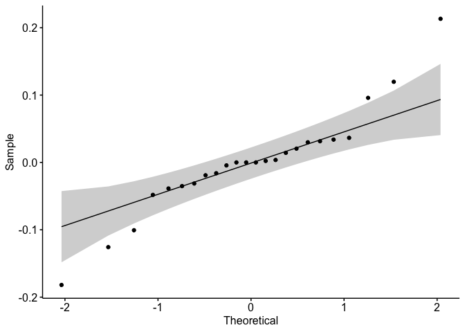

## Load libraries


```r
library(tidyverse)
library(ggpubr)
library(ggtext)
library(patchwork)

knitr::opts_chunk$set(warning=FALSE,message=FALSE)

# set global theme
theme_set(theme_minimal()+
             theme(panel.grid.major.y = element_line(color="grey80"), strip.text=element_text(size=16),
                   strip.background = element_rect(color="transparent"),
                   strip.text.y = element_text(angle=0), plot.caption = element_text(size=10),
                   panel.grid.major.x = element_blank(),legend.position="bottom",
                   plot.background = element_rect(fill="transparent", color="transparent"),
                   axis.ticks = element_line(inherit.blank = FALSE),
                   panel.background = element_blank(), 
                   legend.title = element_text(size=18),
                   axis.text = element_text(size=15), axis.title = element_text(size=18),
                   legend.text = element_text(size=16), plot.title = element_text(hjust=0.5)))
```

## Import data


```r
oysterdata <- readxl::read_excel("PointJudith_EnvironmentalSummary_20230703.xlsx",
                           sheet="GrowthWeightMortality")

incubationdata <- readxl::read_excel("PointJudith_EnvironmentalSummary_20230703.xlsx",
                           sheet="GasProduction") %>% 
   filter(Location!="Seawater Control")

DINdataAugust <- readxl::read_excel("PointJudith_EnvironmentalSummary_20230703.xlsx",
                           sheet="inSituDIN") %>% 
   filter(Month == "August")


NorthernEnvdataAugust <- readxl::read_excel("PointJudith_EnvironmentalSummary_20230703.xlsx",
                           sheet="rawNorthEnvParam") %>% 
   add_column("Location" = "Northern") %>% 
   filter(between(TimeStamp, as.Date("2017-08-01"), as.Date("2017-09-01"))) %>% 
   select(-c(ODOsat_perc, Chl_ug.L, `BGA-PC_RFU`, `BGA-PC_µg.L`))

SouthernEnvdataAugust <- readxl::read_excel("PointJudith_EnvironmentalSummary_20230703.xlsx",
                           sheet="rawSouthEnvParam") %>% add_column("Location" = "Southern") %>% 
   filter(between(TimeStamp, as.Date("2017-08-01"), as.Date("2017-09-01"))) %>% 
   select(-c(ODOsat_perc, Chl_ug.L, Temp_F, pH)) # pH was uncalibrated at southern site

EnvdataAugust <- full_join(NorthernEnvdataAugust, SouthernEnvdataAugust)
```

------------------------------------------------------------------------

# in Situ environmental parameters

## Plot in situ env param over time


```r
EnvdataAugust %>% pivot_longer(Temp_C:ODO_mg.L) %>% 
   ggplot(aes(x=TimeStamp, y=value, color=Location))+
   facet_grid(name~., scales="free_y")+
   scale_x_datetime(expand=c(0,0))+
   geom_line()+
   scale_color_manual(values=c("cornflowerblue","seagreen3"))
```

<!-- -->

## Averages


```r
EnvdataAugust %>% pivot_longer(Temp_C:ODO_mg.L) %>% 
   ggplot(aes(x=Location, y=value, fill=Location))+
   facet_grid(.~name, scales="free_y")+
   stat_summary(geom="bar", fun="mean")+
   scale_fill_manual(values=c("seagreen3","cornflowerblue"))
```

<!-- -->

```r
EnvdataAugust %>% 
   group_by(Location) %>% 
   summarise_all(c("mean" = mean, "sd" = sd)) %>% 
   gt::gt()
```

```{=html}
<div id="rwyhapulei" style="padding-left:0px;padding-right:0px;padding-top:10px;padding-bottom:10px;overflow-x:auto;overflow-y:auto;width:auto;height:auto;">
<style>html {
  font-family: -apple-system, BlinkMacSystemFont, 'Segoe UI', Roboto, Oxygen, Ubuntu, Cantarell, 'Helvetica Neue', 'Fira Sans', 'Droid Sans', Arial, sans-serif;
}

#rwyhapulei .gt_table {
  display: table;
  border-collapse: collapse;
  margin-left: auto;
  margin-right: auto;
  color: #333333;
  font-size: 16px;
  font-weight: normal;
  font-style: normal;
  background-color: #FFFFFF;
  width: auto;
  border-top-style: solid;
  border-top-width: 2px;
  border-top-color: #A8A8A8;
  border-right-style: none;
  border-right-width: 2px;
  border-right-color: #D3D3D3;
  border-bottom-style: solid;
  border-bottom-width: 2px;
  border-bottom-color: #A8A8A8;
  border-left-style: none;
  border-left-width: 2px;
  border-left-color: #D3D3D3;
}

#rwyhapulei .gt_heading {
  background-color: #FFFFFF;
  text-align: center;
  border-bottom-color: #FFFFFF;
  border-left-style: none;
  border-left-width: 1px;
  border-left-color: #D3D3D3;
  border-right-style: none;
  border-right-width: 1px;
  border-right-color: #D3D3D3;
}

#rwyhapulei .gt_caption {
  padding-top: 4px;
  padding-bottom: 4px;
}

#rwyhapulei .gt_title {
  color: #333333;
  font-size: 125%;
  font-weight: initial;
  padding-top: 4px;
  padding-bottom: 4px;
  padding-left: 5px;
  padding-right: 5px;
  border-bottom-color: #FFFFFF;
  border-bottom-width: 0;
}

#rwyhapulei .gt_subtitle {
  color: #333333;
  font-size: 85%;
  font-weight: initial;
  padding-top: 0;
  padding-bottom: 6px;
  padding-left: 5px;
  padding-right: 5px;
  border-top-color: #FFFFFF;
  border-top-width: 0;
}

#rwyhapulei .gt_bottom_border {
  border-bottom-style: solid;
  border-bottom-width: 2px;
  border-bottom-color: #D3D3D3;
}

#rwyhapulei .gt_col_headings {
  border-top-style: solid;
  border-top-width: 2px;
  border-top-color: #D3D3D3;
  border-bottom-style: solid;
  border-bottom-width: 2px;
  border-bottom-color: #D3D3D3;
  border-left-style: none;
  border-left-width: 1px;
  border-left-color: #D3D3D3;
  border-right-style: none;
  border-right-width: 1px;
  border-right-color: #D3D3D3;
}

#rwyhapulei .gt_col_heading {
  color: #333333;
  background-color: #FFFFFF;
  font-size: 100%;
  font-weight: normal;
  text-transform: inherit;
  border-left-style: none;
  border-left-width: 1px;
  border-left-color: #D3D3D3;
  border-right-style: none;
  border-right-width: 1px;
  border-right-color: #D3D3D3;
  vertical-align: bottom;
  padding-top: 5px;
  padding-bottom: 6px;
  padding-left: 5px;
  padding-right: 5px;
  overflow-x: hidden;
}

#rwyhapulei .gt_column_spanner_outer {
  color: #333333;
  background-color: #FFFFFF;
  font-size: 100%;
  font-weight: normal;
  text-transform: inherit;
  padding-top: 0;
  padding-bottom: 0;
  padding-left: 4px;
  padding-right: 4px;
}

#rwyhapulei .gt_column_spanner_outer:first-child {
  padding-left: 0;
}

#rwyhapulei .gt_column_spanner_outer:last-child {
  padding-right: 0;
}

#rwyhapulei .gt_column_spanner {
  border-bottom-style: solid;
  border-bottom-width: 2px;
  border-bottom-color: #D3D3D3;
  vertical-align: bottom;
  padding-top: 5px;
  padding-bottom: 5px;
  overflow-x: hidden;
  display: inline-block;
  width: 100%;
}

#rwyhapulei .gt_group_heading {
  padding-top: 8px;
  padding-bottom: 8px;
  padding-left: 5px;
  padding-right: 5px;
  color: #333333;
  background-color: #FFFFFF;
  font-size: 100%;
  font-weight: initial;
  text-transform: inherit;
  border-top-style: solid;
  border-top-width: 2px;
  border-top-color: #D3D3D3;
  border-bottom-style: solid;
  border-bottom-width: 2px;
  border-bottom-color: #D3D3D3;
  border-left-style: none;
  border-left-width: 1px;
  border-left-color: #D3D3D3;
  border-right-style: none;
  border-right-width: 1px;
  border-right-color: #D3D3D3;
  vertical-align: middle;
  text-align: left;
}

#rwyhapulei .gt_empty_group_heading {
  padding: 0.5px;
  color: #333333;
  background-color: #FFFFFF;
  font-size: 100%;
  font-weight: initial;
  border-top-style: solid;
  border-top-width: 2px;
  border-top-color: #D3D3D3;
  border-bottom-style: solid;
  border-bottom-width: 2px;
  border-bottom-color: #D3D3D3;
  vertical-align: middle;
}

#rwyhapulei .gt_from_md > :first-child {
  margin-top: 0;
}

#rwyhapulei .gt_from_md > :last-child {
  margin-bottom: 0;
}

#rwyhapulei .gt_row {
  padding-top: 8px;
  padding-bottom: 8px;
  padding-left: 5px;
  padding-right: 5px;
  margin: 10px;
  border-top-style: solid;
  border-top-width: 1px;
  border-top-color: #D3D3D3;
  border-left-style: none;
  border-left-width: 1px;
  border-left-color: #D3D3D3;
  border-right-style: none;
  border-right-width: 1px;
  border-right-color: #D3D3D3;
  vertical-align: middle;
  overflow-x: hidden;
}

#rwyhapulei .gt_stub {
  color: #333333;
  background-color: #FFFFFF;
  font-size: 100%;
  font-weight: initial;
  text-transform: inherit;
  border-right-style: solid;
  border-right-width: 2px;
  border-right-color: #D3D3D3;
  padding-left: 5px;
  padding-right: 5px;
}

#rwyhapulei .gt_stub_row_group {
  color: #333333;
  background-color: #FFFFFF;
  font-size: 100%;
  font-weight: initial;
  text-transform: inherit;
  border-right-style: solid;
  border-right-width: 2px;
  border-right-color: #D3D3D3;
  padding-left: 5px;
  padding-right: 5px;
  vertical-align: top;
}

#rwyhapulei .gt_row_group_first td {
  border-top-width: 2px;
}

#rwyhapulei .gt_summary_row {
  color: #333333;
  background-color: #FFFFFF;
  text-transform: inherit;
  padding-top: 8px;
  padding-bottom: 8px;
  padding-left: 5px;
  padding-right: 5px;
}

#rwyhapulei .gt_first_summary_row {
  border-top-style: solid;
  border-top-color: #D3D3D3;
}

#rwyhapulei .gt_first_summary_row.thick {
  border-top-width: 2px;
}

#rwyhapulei .gt_last_summary_row {
  padding-top: 8px;
  padding-bottom: 8px;
  padding-left: 5px;
  padding-right: 5px;
  border-bottom-style: solid;
  border-bottom-width: 2px;
  border-bottom-color: #D3D3D3;
}

#rwyhapulei .gt_grand_summary_row {
  color: #333333;
  background-color: #FFFFFF;
  text-transform: inherit;
  padding-top: 8px;
  padding-bottom: 8px;
  padding-left: 5px;
  padding-right: 5px;
}

#rwyhapulei .gt_first_grand_summary_row {
  padding-top: 8px;
  padding-bottom: 8px;
  padding-left: 5px;
  padding-right: 5px;
  border-top-style: double;
  border-top-width: 6px;
  border-top-color: #D3D3D3;
}

#rwyhapulei .gt_striped {
  background-color: rgba(128, 128, 128, 0.05);
}

#rwyhapulei .gt_table_body {
  border-top-style: solid;
  border-top-width: 2px;
  border-top-color: #D3D3D3;
  border-bottom-style: solid;
  border-bottom-width: 2px;
  border-bottom-color: #D3D3D3;
}

#rwyhapulei .gt_footnotes {
  color: #333333;
  background-color: #FFFFFF;
  border-bottom-style: none;
  border-bottom-width: 2px;
  border-bottom-color: #D3D3D3;
  border-left-style: none;
  border-left-width: 2px;
  border-left-color: #D3D3D3;
  border-right-style: none;
  border-right-width: 2px;
  border-right-color: #D3D3D3;
}

#rwyhapulei .gt_footnote {
  margin: 0px;
  font-size: 90%;
  padding-left: 4px;
  padding-right: 4px;
  padding-left: 5px;
  padding-right: 5px;
}

#rwyhapulei .gt_sourcenotes {
  color: #333333;
  background-color: #FFFFFF;
  border-bottom-style: none;
  border-bottom-width: 2px;
  border-bottom-color: #D3D3D3;
  border-left-style: none;
  border-left-width: 2px;
  border-left-color: #D3D3D3;
  border-right-style: none;
  border-right-width: 2px;
  border-right-color: #D3D3D3;
}

#rwyhapulei .gt_sourcenote {
  font-size: 90%;
  padding-top: 4px;
  padding-bottom: 4px;
  padding-left: 5px;
  padding-right: 5px;
}

#rwyhapulei .gt_left {
  text-align: left;
}

#rwyhapulei .gt_center {
  text-align: center;
}

#rwyhapulei .gt_right {
  text-align: right;
  font-variant-numeric: tabular-nums;
}

#rwyhapulei .gt_font_normal {
  font-weight: normal;
}

#rwyhapulei .gt_font_bold {
  font-weight: bold;
}

#rwyhapulei .gt_font_italic {
  font-style: italic;
}

#rwyhapulei .gt_super {
  font-size: 65%;
}

#rwyhapulei .gt_footnote_marks {
  font-style: italic;
  font-weight: normal;
  font-size: 75%;
  vertical-align: 0.4em;
}

#rwyhapulei .gt_asterisk {
  font-size: 100%;
  vertical-align: 0;
}

#rwyhapulei .gt_indent_1 {
  text-indent: 5px;
}

#rwyhapulei .gt_indent_2 {
  text-indent: 10px;
}

#rwyhapulei .gt_indent_3 {
  text-indent: 15px;
}

#rwyhapulei .gt_indent_4 {
  text-indent: 20px;
}

#rwyhapulei .gt_indent_5 {
  text-indent: 25px;
}
</style>
<table class="gt_table">
  
  <thead class="gt_col_headings">
    <tr>
      <th class="gt_col_heading gt_columns_bottom_border gt_left" rowspan="1" colspan="1" scope="col" id="Location">Location</th>
      <th class="gt_col_heading gt_columns_bottom_border gt_right" rowspan="1" colspan="1" scope="col" id="TimeStamp_mean">TimeStamp_mean</th>
      <th class="gt_col_heading gt_columns_bottom_border gt_right" rowspan="1" colspan="1" scope="col" id="Temp_C_mean">Temp_C_mean</th>
      <th class="gt_col_heading gt_columns_bottom_border gt_right" rowspan="1" colspan="1" scope="col" id="Sal_ppt_mean">Sal_ppt_mean</th>
      <th class="gt_col_heading gt_columns_bottom_border gt_right" rowspan="1" colspan="1" scope="col" id="pH_mean">pH_mean</th>
      <th class="gt_col_heading gt_columns_bottom_border gt_right" rowspan="1" colspan="1" scope="col" id="Chl_RFU_mean">Chl_RFU_mean</th>
      <th class="gt_col_heading gt_columns_bottom_border gt_right" rowspan="1" colspan="1" scope="col" id="ODO_mg.L_mean">ODO_mg.L_mean</th>
      <th class="gt_col_heading gt_columns_bottom_border gt_right" rowspan="1" colspan="1" scope="col" id="TimeStamp_sd">TimeStamp_sd</th>
      <th class="gt_col_heading gt_columns_bottom_border gt_right" rowspan="1" colspan="1" scope="col" id="Temp_C_sd">Temp_C_sd</th>
      <th class="gt_col_heading gt_columns_bottom_border gt_right" rowspan="1" colspan="1" scope="col" id="Sal_ppt_sd">Sal_ppt_sd</th>
      <th class="gt_col_heading gt_columns_bottom_border gt_right" rowspan="1" colspan="1" scope="col" id="pH_sd">pH_sd</th>
      <th class="gt_col_heading gt_columns_bottom_border gt_right" rowspan="1" colspan="1" scope="col" id="Chl_RFU_sd">Chl_RFU_sd</th>
      <th class="gt_col_heading gt_columns_bottom_border gt_right" rowspan="1" colspan="1" scope="col" id="ODO_mg.L_sd">ODO_mg.L_sd</th>
    </tr>
  </thead>
  <tbody class="gt_table_body">
    <tr><td headers="Location" class="gt_row gt_left">Northern</td>
<td headers="TimeStamp_mean" class="gt_row gt_right">2017-08-15 03:38:20</td>
<td headers="Temp_C_mean" class="gt_row gt_right">24.60521</td>
<td headers="Sal_ppt_mean" class="gt_row gt_right">32.39770</td>
<td headers="pH_mean" class="gt_row gt_right">6.909573</td>
<td headers="Chl_RFU_mean" class="gt_row gt_right">5.939827</td>
<td headers="ODO_mg.L_mean" class="gt_row gt_right">5.465327</td>
<td headers="TimeStamp_sd" class="gt_row gt_right">706286.9</td>
<td headers="Temp_C_sd" class="gt_row gt_right">1.004267</td>
<td headers="Sal_ppt_sd" class="gt_row gt_right">0.8912428</td>
<td headers="pH_sd" class="gt_row gt_right">0.006249179</td>
<td headers="Chl_RFU_sd" class="gt_row gt_right">8.060792</td>
<td headers="ODO_mg.L_sd" class="gt_row gt_right">1.951914</td></tr>
    <tr><td headers="Location" class="gt_row gt_left">Southern</td>
<td headers="TimeStamp_mean" class="gt_row gt_right">2017-08-16 11:53:20</td>
<td headers="Temp_C_mean" class="gt_row gt_right">22.33224</td>
<td headers="Sal_ppt_mean" class="gt_row gt_right">31.72739</td>
<td headers="pH_mean" class="gt_row gt_right">NA</td>
<td headers="Chl_RFU_mean" class="gt_row gt_right">1.889764</td>
<td headers="ODO_mg.L_mean" class="gt_row gt_right">7.061409</td>
<td headers="TimeStamp_sd" class="gt_row gt_right">773317.3</td>
<td headers="Temp_C_sd" class="gt_row gt_right">1.416479</td>
<td headers="Sal_ppt_sd" class="gt_row gt_right">1.1305025</td>
<td headers="pH_sd" class="gt_row gt_right">NA</td>
<td headers="Chl_RFU_sd" class="gt_row gt_right">10.880249</td>
<td headers="ODO_mg.L_sd" class="gt_row gt_right">1.373417</td></tr>
  </tbody>
  
  
</table>
</div>
```
# Gas incubation rates


```r
incubationdata %>% 
   unite("Condition", Location, Treatment, remove=FALSE) %>% 
   pivot_longer(c(N2_Rate.nmol_gWetWeight_hr, N2O_Rate.nmol_gWetWeight_hr)) %>% 
   ggplot(aes(x=Location, y=value, fill=Condition)) +
   facet_grid(name~IncubationTemperature, scales="free_y") +
   stat_summary(geom="bar", fun.y="mean", position="dodge")+
   stat_summary(geom="errorbar", fun.data="mean_sdl", position="dodge", color="black")+
   geom_hline(aes(yintercept=0))+
   scale_fill_manual(values=c("lightgreen","darkgreen","lightblue","darkblue"))
```

<!-- -->

```r
# only denitrification
n2plot <- incubationdata %>% 
   unite("Condition", Location, Treatment, remove=FALSE) %>% 
   mutate(IncubationTemperature=factor(IncubationTemperature, labels=c("18˚C","24˚C")),
          Condition=factor(Condition, labels=c("Northern Ambient","Northern Enriched",
                                               "Southern Ambient","Southern Enriched"))) %>% 
   ggplot(aes(x=Location, y=N2_Rate.nmol_gWetWeight_hr, fill=Condition)) +
   facet_grid(.~IncubationTemperature, scales="free_y") +
   stat_summary(geom="bar", fun.y="mean", position=position_dodge(width=1))+
   stat_summary(geom="errorbar", fun.data="mean_sdl", color="grey60", width=0.2, position=position_dodge(width=1))+
   geom_point(shape=22, position=position_dodge(width=1), show.legend = FALSE)+
   geom_hline(aes(yintercept=0))+
   labs(x=NULL, y="N<sub>2</sub> production rate <br>(nmol per g wet weight per hour)", title = "Denitrification (N<sub>2</sub>)") +
   scale_fill_manual(values=c("lightgreen","darkgreen","lightblue","darkblue"))+
   theme(axis.title.y=element_markdown(size=15), legend.position = "right",
         legend.text=element_markdown(size=15), strip.background = element_rect(color="transparent", fill="grey90"),
         plot.title = element_markdown(size=18))

# nitrous oxide
n2oplot <- incubationdata %>% 
   unite("Condition", Location, Treatment, remove=FALSE) %>% 
   mutate(IncubationTemperature=factor(IncubationTemperature, labels=c("18˚C","24˚C")),
          Condition=factor(Condition, labels=c("Northern Ambient","Northern Enriched",
                                               "Southern Ambient","Southern Enriched"))) %>% 
   ggplot(aes(x=Location, y=N2O_Rate.nmol_gWetWeight_hr, fill=Condition)) +
   facet_grid(.~IncubationTemperature, scales="free_y") +
   stat_summary(geom="bar", fun.y="mean", position=position_dodge(width=1))+
   stat_summary(geom="errorbar", fun.data="mean_sdl", color="grey60", width=0.2, position=position_dodge(width=1))+
   geom_point(shape=22, position=position_dodge(width=1), show.legend = FALSE)+
   geom_hline(aes(yintercept=0))+
   labs(x=NULL, y="N<sub>2</sub>O production rate <br>(nmol per g wet weight per hour)", title = "Nitrous Oxide (N<sub>2</sub>O)") +
   scale_fill_manual(values=c("lightgreen","darkgreen","lightblue","darkblue"))+
   theme(axis.title.y=element_markdown(size=15), legend.position = "right",
         legend.text=element_markdown(size=15), strip.background = element_rect(color="transparent", fill="grey90"),
         plot.title = element_markdown(size=18))

(n2plot/n2oplot)+
   plot_annotation(tag_levels = "A") + 
   plot_layout(guides = "collect") & theme(legend.position = "right")
```

<!-- -->

```r
ggsave("GasRates.png", width = 9, height=7)
```


```r
compare_means(data=incubationdata,
               c(N2_Rate.nmol_gWetWeight_hr,N2O_Rate.nmol_gWetWeight_hr)~Treatment,
               group.by = "Location")
```

```
## # A tibble: 4 × 9
##   Location .y.                  group1 group2     p p.adj p.for…¹ p.sig…² method
##   <chr>    <fct>                <chr>  <chr>  <dbl> <dbl> <chr>   <chr>   <chr> 
## 1 Northern N2_Rate.nmol_gWetWe… Ambie… Enric… 0.336  0.67 0.34    ns      Wilco…
## 2 Southern N2_Rate.nmol_gWetWe… Ambie… Enric… 0.748  0.75 0.75    ns      Wilco…
## 3 Northern N2O_Rate.nmol_gWetW… Ambie… Enric… 0.934  1    0.93    ns      Wilco…
## 4 Southern N2O_Rate.nmol_gWetW… Ambie… Enric… 0.936  1    0.94    ns      Wilco…
## # … with abbreviated variable names ¹​p.format, ²​p.signif
```

```r
compare_means(data=incubationdata,
               c(N2_Rate.nmol_gWetWeight_hr,N2O_Rate.nmol_gWetWeight_hr)~IncubationTemperature,
               group.by = c("Location", "Treatment"))
```

```
## # A tibble: 8 × 10
##   Location Treatment .y.        group1 group2     p p.adj p.for…¹ p.sig…² method
##   <chr>    <chr>     <fct>      <chr>  <chr>  <dbl> <dbl> <chr>   <chr>   <chr> 
## 1 Northern Ambient   N2_Rate.n… 18     24     0.4    1    0.40    ns      Wilco…
## 2 Northern Enriched  N2_Rate.n… 18     24     0.7    1    0.70    ns      Wilco…
## 3 Southern Ambient   N2_Rate.n… 18     24     1      1    1.00    ns      Wilco…
## 4 Southern Enriched  N2_Rate.n… 18     24     0.1    0.4  0.10    ns      Wilco…
## 5 Northern Ambient   N2O_Rate.… 18     24     0.197  0.59 0.20    ns      Wilco…
## 6 Northern Enriched  N2O_Rate.… 18     24     0.1    0.4  0.10    ns      Wilco…
## 7 Southern Ambient   N2O_Rate.… 18     24     0.507  1    0.51    ns      Wilco…
## 8 Southern Enriched  N2O_Rate.… 18     24     1      1    1.00    ns      Wilco…
## # … with abbreviated variable names ¹​p.format, ²​p.signif
```

```r
aovN2<- aov(data=incubationdata, N2_Rate.nmol_gWetWeight_hr~Location*Treatment*IncubationTemperature)
ggqqplot(residuals(aovN2))
```

<!-- -->

```r
rstatix::shapiro_test(residuals(aovN2))
```

```
## # A tibble: 1 × 3
##   variable         statistic p.value
##   <chr>                <dbl>   <dbl>
## 1 residuals(aovN2)     0.967   0.603
```

```r
# In the QQ plot, as all the points fall approximately along the reference line, we can assume normality. This conclusion is supported by the Shapiro-Wilk test. The p-value is not significant (p = 0.603), so we can assume normality.
summary(aovN2)
```

```
##                                          Df Sum Sq Mean Sq F value Pr(>F)  
## Location                                  1   1828    1828   0.242 0.6292  
## Treatment                                 1   5496    5496   0.729 0.4059  
## IncubationTemperature                     1   9231    9231   1.224 0.2850  
## Location:Treatment                        1   4865    4865   0.645 0.4337  
## Location:IncubationTemperature            1  24011   24011   3.183 0.0934 .
## Treatment:IncubationTemperature           1  64317   64317   8.526 0.0100 *
## Location:Treatment:IncubationTemperature  1   5328    5328   0.706 0.4131  
## Residuals                                16 120699    7544                 
## ---
## Signif. codes:  0 '***' 0.001 '**' 0.01 '*' 0.05 '.' 0.1 ' ' 1
```

```r
aovN2O<- aov(data=incubationdata, N2O_Rate.nmol_gWetWeight_hr~Location*Treatment*IncubationTemperature)
summary(aovN2O)
```

```
##                                          Df  Sum Sq Mean Sq F value Pr(>F)  
## Location                                  1 0.00500 0.00500   0.572 0.4604  
## Treatment                                 1 0.00488 0.00488   0.559 0.4654  
## IncubationTemperature                     1 0.06627 0.06627   7.591 0.0141 *
## Location:Treatment                        1 0.00034 0.00034   0.039 0.8453  
## Location:IncubationTemperature            1 0.02125 0.02125   2.434 0.1383  
## Treatment:IncubationTemperature           1 0.00170 0.00170   0.195 0.6646  
## Location:Treatment:IncubationTemperature  1 0.00000 0.00000   0.000 0.9906  
## Residuals                                16 0.13968 0.00873                 
## ---
## Signif. codes:  0 '***' 0.001 '**' 0.01 '*' 0.05 '.' 0.1 ' ' 1
```

```r
ggqqplot(residuals(aovN2O))
```

<!-- -->

```r
rstatix::shapiro_test(residuals(aovN2O))
```

```
## # A tibble: 1 × 3
##   variable          statistic p.value
##   <chr>                 <dbl>   <dbl>
## 1 residuals(aovN2O)     0.925  0.0755
```

# In Situ DIN measurements


```r
DINdataAugust %>% 
   group_by(Location, Treatment) %>% 
   summarise(NH4mean = mean(NH4.uM, na.rm = TRUE),
                NH4sd = sd(NH4.uM, na.rm = TRUE),
                NO3mean = mean(NO3.uM),
                NO3sd = sd(NO3.uM),
                NO2mean = mean(NO2.uM),
                NO2sd = sd(NO2.uM))
```

```
## # A tibble: 4 × 8
## # Groups:   Location [2]
##   Location Treatment NH4mean NH4sd NO3mean NO3sd NO2mean  NO2sd
##   <chr>    <chr>       <dbl> <dbl>   <dbl> <dbl>   <dbl>  <dbl>
## 1 Northern Ambient      37.6 17.6    0.656 0.432  0.0905 0.0575
## 2 Northern Enriched     32.7  8.09   0.937 1.00   0.0575 0.0720
## 3 Southern Ambient      22.5  6.31   0.320 0.136  0.0926 0.0581
## 4 Southern Enriched     28.7  9.15   0.255 0.342  0.0751 0.0712
```

```r
DINdataAugust %>% 
   unite("Condition", Location, Treatment, remove=FALSE) %>% 
   pivot_longer(NH4.uM:NO2.uM) %>% 
   ggplot(aes(x=Location, y=value, fill=Condition)) +
   facet_wrap(Tide~name, scales="free_y") +
   stat_summary(geom="bar", fun.y="mean", position=position_dodge())+
   stat_summary(geom="errorbar", fun.data="mean_sdl", color="grey60", 
                position=position_dodge(width=0.9), width=0.2)+
   geom_point(shape=22, position=position_dodge(width=0.9))+
   stat_compare_means(comparisons=c("Northern_Ambient", "Northern_Enriched"))+
   geom_hline(aes(yintercept=0))+
   labs(x=NULL, y="N2O production rate (nmol per g wet weight per hour)", title = "Nitrous Oxide (N2O)") +
   scale_fill_manual(values=c("lightgreen","darkgreen","lightblue","darkblue"))+
   theme(legend.position = "right")
```

<!-- -->

```r
DINdataAugust %>% 
   unite("Condition", Location, Treatment, remove=FALSE) %>% 
   pivot_longer(NH4.uM:NO2.uM) %>% 
   ggplot(aes(x=Location, y=value, fill=Condition)) +
   facet_wrap(.~name, scales="free_y") +
   geom_boxplot()+
   geom_point(shape=22, position=position_dodge(width=0.9))+
   stat_compare_means(comparisons=c("Northern_Ambient", "Northern_Enriched"))+
   geom_hline(aes(yintercept=0))+
   labs(x=NULL, y="in Situ gas concentration (µM)") +
   scale_fill_manual(values=c("lightgreen","darkgreen","lightblue","darkblue"))+
   theme(legend.position = "right")
```

<!-- -->


# Session Info


```r
sessionInfo()
```

```
## R version 4.1.3 (2022-03-10)
## Platform: x86_64-apple-darwin17.0 (64-bit)
## Running under: macOS Big Sur/Monterey 10.16
## 
## Matrix products: default
## BLAS:   /Library/Frameworks/R.framework/Versions/4.1/Resources/lib/libRblas.0.dylib
## LAPACK: /Library/Frameworks/R.framework/Versions/4.1/Resources/lib/libRlapack.dylib
## 
## locale:
## [1] en_US.UTF-8/en_US.UTF-8/en_US.UTF-8/C/en_US.UTF-8/en_US.UTF-8
## 
## attached base packages:
## [1] stats     graphics  grDevices utils     datasets  methods   base     
## 
## other attached packages:
##  [1] patchwork_1.1.2 ggtext_0.1.2    ggpubr_0.6.0    lubridate_1.9.2
##  [5] forcats_1.0.0   stringr_1.5.0   dplyr_1.1.0     purrr_1.0.1    
##  [9] readr_2.1.4     tidyr_1.3.0     tibble_3.1.8    ggplot2_3.4.1  
## [13] tidyverse_2.0.0
## 
## loaded via a namespace (and not attached):
##  [1] RColorBrewer_1.1-3  tools_4.1.3         backports_1.4.1    
##  [4] bslib_0.4.2         utf8_1.2.3          R6_2.5.1           
##  [7] rpart_4.1.19        Hmisc_4.8-0         colorspace_2.1-0   
## [10] nnet_7.3-18         withr_2.5.0         tidyselect_1.2.0   
## [13] gridExtra_2.3       compiler_4.1.3      textshaping_0.3.6  
## [16] cli_3.6.0           gt_0.8.0            htmlTable_2.4.1    
## [19] xml2_1.3.3          labeling_0.4.2      sass_0.4.5         
## [22] scales_1.2.1        checkmate_2.1.0     commonmark_1.8.1   
## [25] systemfonts_1.0.4   digest_0.6.31       foreign_0.8-84     
## [28] rmarkdown_2.20      base64enc_0.1-3     jpeg_0.1-10        
## [31] pkgconfig_2.0.3     htmltools_0.5.4     fastmap_1.1.0      
## [34] highr_0.10          htmlwidgets_1.6.1   rlang_1.0.6        
## [37] readxl_1.4.2        rstudioapi_0.14     jquerylib_0.1.4    
## [40] farver_2.1.1        generics_0.1.3      jsonlite_1.8.4     
## [43] car_3.1-1           magrittr_2.0.3      Formula_1.2-4      
## [46] interp_1.1-3        Matrix_1.4-1        Rcpp_1.0.10        
## [49] munsell_0.5.0       fansi_1.0.4         abind_1.4-5        
## [52] lifecycle_1.0.3     stringi_1.7.12      yaml_2.3.7         
## [55] carData_3.0-5       grid_4.1.3          deldir_1.0-6       
## [58] lattice_0.20-45     splines_4.1.3       gridtext_0.1.5     
## [61] hms_1.1.2           knitr_1.42          pillar_1.8.1       
## [64] markdown_1.5        ggsignif_0.6.4      glue_1.6.2         
## [67] evaluate_0.20       latticeExtra_0.6-30 data.table_1.14.8  
## [70] png_0.1-8           vctrs_0.5.2         tzdb_0.3.0         
## [73] cellranger_1.1.0    gtable_0.3.1        cachem_1.0.6       
## [76] xfun_0.37           broom_1.0.3         rstatix_0.7.2      
## [79] ragg_1.2.5          survival_3.5-3      cluster_2.1.4      
## [82] timechange_0.2.0    ellipsis_0.3.2
```
