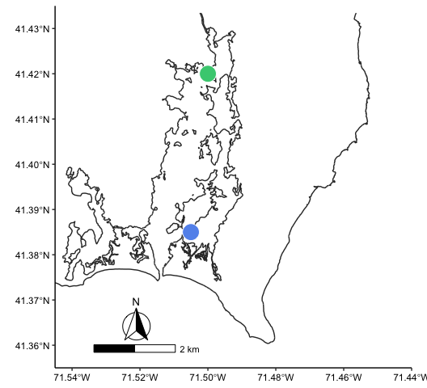

## Load libraries


```r
library(sf)
library(tidyverse)
library(ggspatial)

knitr::opts_chunk$set(warning=FALSE,message=FALSE)
```

## Import data


```r
crs_use <- "+proj=laea +lat_0=30 +lon_0=-95"

sitedata <- data.frame(Lat = c("41.385","41.42"),
                   Long = c("-71.505","-71.50"),
                   Station = c("BHC","BC"),
                   Location = c("Southern","Northern")) %>% 
  st_as_sf(coords = c("Long", "Lat"), crs = 4326) %>% 
  st_transform(crs = crs_use)

mapdata <- st_read("NarrBayMaps/NY137F01/historicl1.shp", quiet = TRUE) %>% 
   filter(CLASS=="SHORELINE")
```

------------------------------------------------------------------------


# Plotting


```r
ggplot() + 
   geom_sf(data=mapdata, color="grey20") +
   geom_sf(data=sitedata, size=7, shape=21, color="white", 
           fill=c("cornflowerblue","seagreen3"))+
   coord_sf(xlim = c(-71.545,-71.44), ylim = c(41.355,41.435), expand = FALSE) + 
   labs(x=NULL, y=NULL) +
   theme(panel.grid = element_blank(), axis.line = element_line(),
         panel.background = element_blank(),
         axis.text = element_text(color="black"))+
   annotation_north_arrow(location = "bl", which_north = TRUE, pad_y = unit(0.3, "in"),
                          pad_x = unit(0.75, "in"), style = north_arrow_fancy_orienteering)+
   annotation_scale(location = "bl", pad_x = unit(0.5, "in"), pad_y = unit(0.2, "in"), width_hint = 0.3)
```

<!-- -->

```r
ggsave("PointJudithMap.png", width=6, height=5)
ggsave("PointJudithMap.svg", width=6, height=5)
```


# Session Info


```r
sessionInfo()
```

```
## R version 4.1.3 (2022-03-10)
## Platform: x86_64-apple-darwin17.0 (64-bit)
## Running under: macOS Big Sur/Monterey 10.16
## 
## Matrix products: default
## BLAS:   /Library/Frameworks/R.framework/Versions/4.1/Resources/lib/libRblas.0.dylib
## LAPACK: /Library/Frameworks/R.framework/Versions/4.1/Resources/lib/libRlapack.dylib
## 
## locale:
## [1] en_US.UTF-8/en_US.UTF-8/en_US.UTF-8/C/en_US.UTF-8/en_US.UTF-8
## 
## attached base packages:
## [1] stats     graphics  grDevices utils     datasets  methods   base     
## 
## other attached packages:
##  [1] ggspatial_1.1.8 lubridate_1.9.2 forcats_1.0.0   stringr_1.5.0  
##  [5] dplyr_1.1.0     purrr_1.0.1     readr_2.1.4     tidyr_1.3.0    
##  [9] tibble_3.1.8    ggplot2_3.4.1   tidyverse_2.0.0 sf_1.0-9       
## 
## loaded via a namespace (and not attached):
##  [1] tidyselect_1.2.0   xfun_0.37          bslib_0.4.2        colorspace_2.1-0  
##  [5] vctrs_0.5.2        generics_0.1.3     htmltools_0.5.4    yaml_2.3.7        
##  [9] utf8_1.2.3         rlang_1.0.6        e1071_1.7-13       jquerylib_0.1.4   
## [13] pillar_1.8.1       glue_1.6.2         withr_2.5.0        DBI_1.1.3         
## [17] lifecycle_1.0.3    munsell_0.5.0      gtable_0.3.1       ragg_1.2.5        
## [21] evaluate_0.20      knitr_1.42         tzdb_0.3.0         fastmap_1.1.0     
## [25] class_7.3-21       fansi_1.0.4        highr_0.10         Rcpp_1.0.10       
## [29] KernSmooth_2.23-20 scales_1.2.1       classInt_0.4-8     cachem_1.0.6      
## [33] jsonlite_1.8.4     systemfonts_1.0.4  farver_2.1.1       textshaping_0.3.6 
## [37] hms_1.1.2          digest_0.6.31      stringi_1.7.12     grid_4.1.3        
## [41] cli_3.6.0          tools_4.1.3        magrittr_2.0.3     sass_0.4.5        
## [45] proxy_0.4-27       pkgconfig_2.0.3    ellipsis_0.3.2     timechange_0.2.0  
## [49] svglite_2.1.1      rmarkdown_2.20     rstudioapi_0.14    R6_2.5.1          
## [53] units_0.8-1        compiler_4.1.3
```
